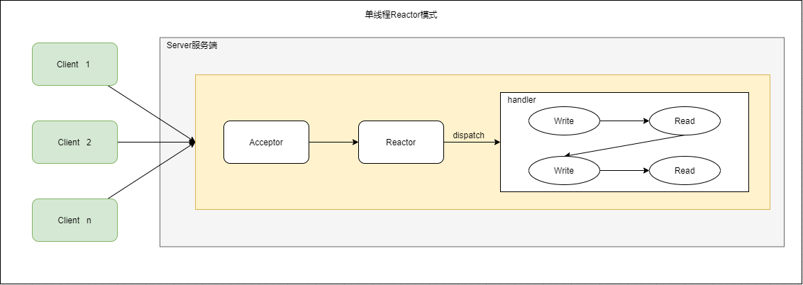
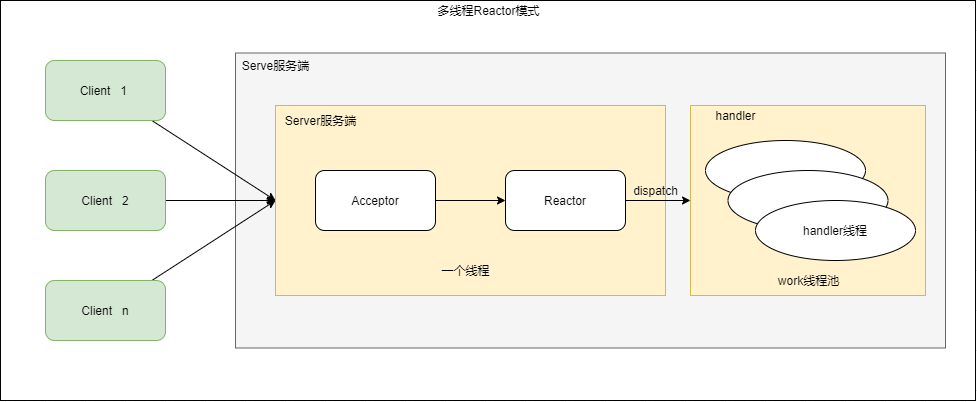
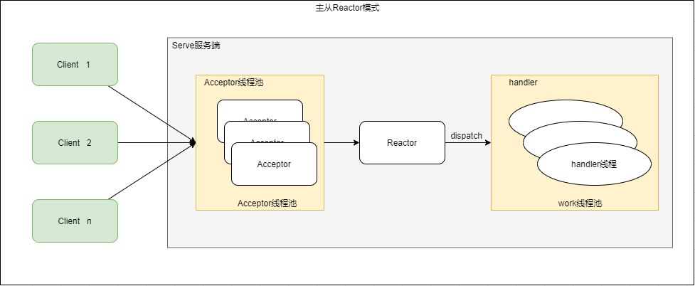

# 操作系统IO过程

应用程序发起的一次IO操作包含两个阶段：
- IO调用：应用程序进程向操作系统内核发起调用
- IO执行：操作系统内核完成IO操作

操作系统内核完成IO操作还包括两个过程：
- 准备数据阶段：内核等待IO设备准备好数据
- 拷贝数据阶段：将数据从内核缓冲区拷贝到用户空间缓冲区


一个完整的IO过程包括以下几个步骤：
- 应用程序进程向操作系统发起IO调用请求
- 操作系统准备数据，把IO外部设备的数据加载到内核缓冲区
- 操作系统拷贝数据，即将内核缓冲区的数据拷贝到进程缓冲区中

# 网络IO模型

**下述所说应用程序，应用进程，应用线程，如无特殊说明都是一个意思**

## 概念

## 同步与异步

同步与异步关注的是**消息通知机制**。
- 所谓同步即实在发出一个调用时，在没有等到结果之前，该调用就不返回，一旦调用返回就得到了返回值。也就是调用者主动等待这个调用结果。
- 异步和同步相反，调用在发出之后，调用立即就返回，没有调用结果。如果调用者要得到结果，必须主动的查询被调用者状态或者被调用者通过通知、回调通知调用者。调用者主动查询，那么调用者一般是定期来查询，效率较低。如果使用通知和回调的方式，效率较高。

### 阻塞和非阻塞

阻塞和非阻塞关注的是**程序在等待调用结果时的状态**
- 阻塞调用是指调用结果返回之前，调用者线程会被挂起。
- 非阻塞调是指调用结果返回之前，调用者线程不会被挂起。

## 阻塞IO(Block IO)

假设应用程序的进程发起IO调用，但是操作系统的内核的数据还没准备好，那么应用程序就一直在**阻塞等待**，直到内核的数据就绪并且操作系统将内核态的数据拷贝到用户态之后才返回调用结果，应用程序线程在得到内核的返回之后才继续执行。这种IO操作称为**阻塞IO**。

阻塞IO是最流行的IO模型,简称BIO，比较经典的应用就是阻塞socket、Java BIO。

阻塞IO的缺点就是：如果内核数据一直没准备好，那么用户进程/线程将一直阻塞，消耗资源。


## 非阻塞IO(Non-Blocking IO)

如果应用程序请求调用后，**内核数据**未就绪前，可以先返回错误信息给应用程序，调用程序不用挂起，通过不断轮询的方式再来请求。这就是非阻塞IO。

非阻塞IO，简称NIO。相对于阻塞IO，虽然大幅提高了性能，但是该种方式仍然存在**性能问题**，即频繁的**轮询**操作，这将导致频繁的系统调用，同样消耗大量的CPU资源。通常在专门提供某一功能的系统中才会使用


## IO多路复用

非阻塞IO的轮询发起recvfrom系统调用，直到操作系统内核的数据就绪，导致消耗CPU资源。因此IO多路复用模型优化的思想将轮询内核数据是否准备好的操作交由系统线程去做(之前由应用程序轮询)，等到内核中的数据准备好了之后，主动通知应用进程，应用程序再去进行recvfrom系统调用。

IO复用模型的核心思路是：系统提供一类函数(select, poll, epoll), 该类函数能够监控多个文件描述符(fd, file descriptor), 任何一个返回内核数据就绪，应用进程再发起recvfrom系统调用。

文件描述符(fd, file descriptor)： linux一切皆文件，当程序打开一个或者创建一个新文件时，内核会向进程返回一个文件描述符，包括接收网络数据。

### IO多路复用-select

应用程序通过调用select函数，可以同时监控多个文件描述符，在select函数监控的文件描述符中，只要有任何一个数据状态准备就绪了，select函数就会返回可读状态，这时应用程序再发起recvfrom系统调用去获取数据。

非阻塞IO模型中，应用程序需要不断的轮询系统调用(recvfrom)，但是select的IO多路复用模型，只需要发起一次系统调用就够了，减少了系统调用的次数, 优化了性能。

但是select有几个缺点：
- 监听的IO最大连接数有限，在linux系统上一般为1024
- select函数内部维护了一个文件描述符的list(数组)，通过遍历该数组找到就绪的文件描述符，效率较低


### IO多路复用-poll

解决了select连接数有限的缺点。其内部同样维护了一个文件描述符的list(链表)，仍然采用遍历的方式找到就绪的文件描述符，效率同样较低

### IO多路复用-epoll

epoll是为了解决select/poll的问题：查找就绪文件描述符效率低的问题，其采用事件驱动来实现的

epoll先通过epoll_ctl()来注册一个文件描述符，一旦基于某个文件描述符就绪时，内核会采用回调机制，迅速激活这个文件描述符，当进程调用epoll_wait()时便得到通知。select/poll查找文件描述的时间复杂度为O(n), epoll去掉了遍历文件描述符数组的过程，采用回调的方式，效率更高，不过实现逻辑更加复杂了(我们也不管，操作系统实现的，哈哈)


### select、poll、epoll区别

||select|poll|epoll|
|---|---|---|---|
|底层数据结构|数组|链表|红黑树和双链表|
|获取就绪的文件描述符|遍历|遍历|回调|
|时间复杂度|O(n)|O(n)|O(1)|
|最大连接数|有限制(1024)|无限制|无限制|
|数据拷贝|每次调用select，需要将fd数据从用户空间拷贝到内核空间|每次调用poll，需要将fd数据从用户空间拷贝到内核空间|使用内存映射(mmap)，不需要从用户空间频繁拷贝fd数据到内核空间|


## 信号驱动模型

IO多路复用，将询问内核数据是否准备好的工作交由一个单独线程去做，但是应用程序仍然是阻塞于该“询问线程的”。而信号驱动模型不再阻塞该“询问线程”。

信号驱动IO不再主动询问的方式去确认数据是否就绪，而是向内核发送一个信号(调用sigaction)的时候建立一个SIGIO信号), 然后应用进程可以去做别的事，不用阻塞。当内核数据准备好之后，再通过SIGIO信号通知应用进程内核数据已准备就绪。应用程序收到信号后，再调用recvfrom系统调用去读取数据。

信号驱动IO模型，在应用进程发出信号后，是立即返回的，不会阻塞进程。它已经有异步操作的感觉了。但是你细看上面的流程图，发现数据复制到应用缓冲的时候，应用进程还是阻塞的。回过头来看下，不管是BIO，还是NIO，还是信号驱动，在数据从内核复制到应用缓冲的时候，都是阻塞的。


## 异步IO(AIO)

前面讲的BIO，NIO和信号驱动，在数据从内核复制到应用缓冲的时候，都是阻塞的，因此都不是真正的异步。AIO实现了IO全流程的非阻塞，就是应用进程发出系统调用后，是立即返回的，但是立即返回的不是处理结果，而是表示调用成功类似的意思。等内核数据准备好，将数据拷贝到用户进程缓冲区，发送信号通知用户进程IO操作执行完毕。

异步IO的优化思路很简单，只需要向内核发送一次请求，就可以完成数据状态询问和数据拷贝的所有操作，并且不用阻塞等待结果。


## 总结


# Reactor模型

网络IO模式是操作系统层面的，而Reactor模型则是应用层面对IO的处理。

## 单线程Reactor



单线程Reactor模型, 所有的IO操作都在一个线程中完成. 这种方式在高负载和高并发的场景下会存在性能瓶颈,一个线程同时处理上万的连接的IO擦做,系统是无法支撑的.

## 多线程Reactor

多线程Reactor模式将请求的处理放在线程池中处理,但是处理连接请求的线程仍然是一个.



## 主从线程Reactor

主从Reactor模型中,Acceptor不再是一个单独的线程,而是一个线程池. Accptor接受到的客户端的连接后,将请求的处理交给handler线程处理.



# Java 网络IO

## BIO

### BioServer

```java

package com.young.io;

import lombok.extern.slf4j.Slf4j;

import java.io.IOException;
import java.io.InputStream;
import java.net.ServerSocket;
import java.net.Socket;
import java.nio.charset.Charset;
import java.util.concurrent.Executors;
import java.util.concurrent.LinkedBlockingQueue;
import java.util.concurrent.ThreadPoolExecutor;
import java.util.concurrent.TimeUnit;

/**
 * BIO服务器
 *
 * @author Young
 * @date 2022/09/03 16:59:02
 */
@Slf4j
public class BioServer {

    public static void main(String[] args) {

        ThreadPoolExecutor executor = new ThreadPoolExecutor(8, 8
                , 30, TimeUnit.SECONDS
                , new LinkedBlockingQueue<>(1024)
                , Executors.defaultThreadFactory()
                , new ThreadPoolExecutor.DiscardPolicy());

        try {
            ServerSocket ss = new ServerSocket(8080);
            log.info("服务端启动成功....");
            while (true) {
                Socket socket = ss.accept();
                log.info("接受连接...");
                executor.execute(() -> handler(socket));
            }
        } catch (IOException e) {
            log.error("服务端报错", e);
        }

    }

    private static void handler(Socket socket) {
        try {
            // 用于存放读取数据的字节数组
            byte[] bytes = new byte[512];
            // 通过socket获取输入流
            InputStream inputStream = socket.getInputStream();
            // 循环读取客户端发送端的数据
            String serverInfo = "Thread id =" + Thread.currentThread().getId() + " " + "name:" + Thread.currentThread().getName();
            log.info(serverInfo);
            log.info("read ...");
            // 输入流把数据读取到bytes中，返回读取数据的个数
            int read = inputStream.read(bytes);
            // 把客户端发送的数据从字节转化为字符串输出
            String rcvString = new String(bytes, 0, read);
            log.info("客户端数据为: \n{}", rcvString);
            socket.getOutputStream().write(serverInfo.getBytes(Charset.forName("UTF8")));
        } catch (Exception e) {
            log.error("读取数据出错", e);
        } finally {
            log.info("关闭和client的连接");
            try {
                socket.close();
            } catch (Exception e) {
                log.error("关闭和client的连接报错", e);
            }
        }
    }

}


```

### BioClient

```java

package com.young.io;

import lombok.extern.slf4j.Slf4j;

import java.io.BufferedReader;
import java.io.BufferedWriter;
import java.io.IOException;
import java.io.InputStream;
import java.io.InputStreamReader;
import java.io.OutputStream;
import java.io.OutputStreamWriter;
import java.net.Socket;
import java.util.concurrent.Executors;
import java.util.concurrent.LinkedBlockingQueue;
import java.util.concurrent.ThreadPoolExecutor;
import java.util.concurrent.TimeUnit;

/**
 * Bio客户端
 *
 * @author Young
 * @date 2022/09/03 20:19:47
 */
@Slf4j
public class BioClient {


    public static void main(String[] args) {
        ThreadPoolExecutor executor = new ThreadPoolExecutor(8, 8
                , 30, TimeUnit.SECONDS
                , new LinkedBlockingQueue<>(1024)
                , Executors.defaultThreadFactory()
                , new ThreadPoolExecutor.DiscardPolicy());
        while (true) {
            executor.execute(() -> doReq());
        }

    }

    private static void doReq() {
        try {
            Socket s = new Socket("127.0.0.1", 8080);
            //构建IO
            InputStream is = s.getInputStream();
            OutputStream os = s.getOutputStream();

            BufferedWriter bw = new BufferedWriter(new OutputStreamWriter(os));
            //向服务器端发送一条消息
            bw.write("我是客户端的消息");
            bw.flush();

            //读取服务器返回的消息
            BufferedReader br = new BufferedReader(new InputStreamReader(is));
            String mess = br.readLine();
            System.out.println("服务器：" + mess);
        } catch (IOException e) {
            log.error("客户端错误", e);
        }
    }
}


```

## NIO

Java NIO的实现主要涉及三大核心内容: Selector, Channel和Buffer. Selector用于监听多个Channel的事件, 比如连接打开或数据到达, 因此一个线程可以实现对多个数据Channel的管理. 传统IO基于数据流进行IO读写操作，而JavaNIO基于Channel和Buffer进行IO读写操作, 并且数据总是被从Channel读取到Buffer中,或者从Buffer写入到Channel中.

### NioServer


```java

package com.young.io;

import java.io.IOException;
import java.net.InetSocketAddress;
import java.nio.ByteBuffer;
import java.nio.channels.SocketChannel;

/**
 * nio客户端
 *
 * @author Young
 * @date 2022/09/03 20:31:31
 */

public class NioClient {
    public static void main(String[] args) {
        try {
            //得到一个SocketChannel
            SocketChannel socketChannel = SocketChannel.open();
            //设置非阻塞
            socketChannel.configureBlocking(false);
            //提供服务器端的ip和端口
            InetSocketAddress inetSocketAddress = new InetSocketAddress("127.0.0.1", 9090);

            //连接服务器,非阻塞情况下，需要调用finishConnect
            /*
             * If this channel is in non-blocking mode then an invocation of this method initiates
             * a non-blocking connection operation. If the connectionis established immediately,
             * as can happen with a local connection, then this method returns true.
             * Otherwise this method returns false and the connection operation must
             * later be completed by invoking the finishConnect method.
             *
             * */
            if (!socketChannel.connect(inetSocketAddress)) {
                while (!socketChannel.finishConnect()) {
                    System.out.println("connect...");
                }
            }


            //如果连接成功，就发送数据
            String str = "hello, world";
            ByteBuffer buffer = ByteBuffer.allocate(str.length());
            buffer.put(str.getBytes());
            buffer.flip();

            //将数据写入 channel
            socketChannel.write(buffer);
        } catch (IOException e) {
            e.printStackTrace();
        }
    }
}


```

### NioClient


# 参考
- [如何理解阻塞、非阻塞与同步、异步的区别](https://zhuanlan.zhihu.com/p/25638474)
- [JavaIO模型](https://javaguide.cn/java/io/io-model.html)
- [100%弄明白5种IO模型](https://zhuanlan.zhihu.com/p/115912936)
- [看一遍就理解：IO模型详解](https://juejin.cn/post/7036518015462015006)
- [五种IO模型介绍和对比](https://cloud.tencent.com/developer/article/1717352)
- [极客时间:Java性能调优实战-刘超](https://time.geekbang.org/column/article/100861)