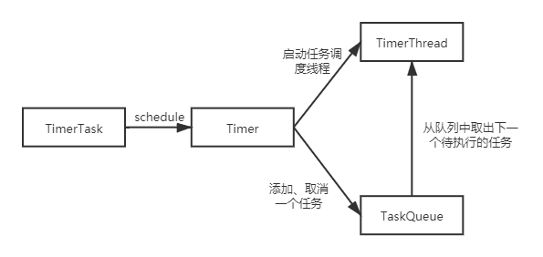

# Timer
## 01 用法

Timer是Java原生的定时器类，通过该类可实现指定时间间隔的定时任务

### 0x01 使用实例

定义一个基于Timer的定时任务非常简单，如下：

```java
import java.util.Date;
import java.util.Timer;
import java.util.TimerTask;

public class TimerExample {
    public static void main(String[] args) {
        // 1. 实例化Timer对象
        Timer timer = new Timer();

        // 2. 定义一个任务
        TimerTask timerTask = new TimerTask() {
            @Override
            public void run() {
                // todo 具体的任务执行逻辑
                System.out.println("定时任务正在执行...");
            }
        };

        // 3. 将timerTask交给Timer进行调度
        timer.schedule(timerTask, new Date(), 10 * 1000L);
    }
}
```

### 0x02 Timer的构造方法详解

```java
Timer() // 无参构造方法，会调用Timer(String name)方法实例化Timer对象，其中name是自动生成的，格式为Timer-[序列号]，使用非后台线程调度任务
Timer(boolean isDaemon) //isDaemon表示是否以后台线程的方式调度任务
Timer(String name) //name是Timer里面任务执行线程（TimerThread）的名字，默认非后台
Timer(String name, boolean isDaemon) //指定Timer的名字和运行方式(后台和非后台)
```

### 0x03 schedule方法的参数详解

```java
schedule(TimerTask task, long delay) // delay时间后执行一次任务, delay的单位为ms
schedule(TimerTask task, Date time) // 在time时间执行一次任务
schedule(TimerTask task, long delay, long period) // 在delay时间后以固定的时间间隔period执行任务， 这里的时间间隔是上一次任务开始执行到下次开始执行的时间间隔, delay的单位为ms

scheduleAtFixedRate(TimerTask task, long delay, long period) // 在delay时间后以固定的时间间隔period执行任务， 这里的时间间隔不同于上面的时间间隔，下面进行详解, delay的单位为ms
scheduleAtFixedRate(TimerTask task, Date firstTime, long period) // 在time时间后以固定的时间间隔period执行任务， 这里的时间间隔不同于上面的时间间隔，下面进行详解
```

schedule方法的时间间隔和scheduleAtFixedRate的时间间隔不同
假如定义一个任务每10s执行一次
schedule任务控制的是在任务执行开始到任务执行结束的时间间隔
如果任务在18:30:10执行一次，第二次和第三次时间执行为 18:30:20和18:30:30
但是任务到达18:30:20的时间时，由于线程没有调度导致任务到18:30:25才调度起来，那么计算第三次任务执行的时间是18:30:35

scheduleAtFixedRate方法的时间间隔是固定的，不计算任务由于没有调度导致的延时
如果任务在18:30:10执行一次，第二次和第三次时间执行为 18:30:20和18:30:30
即使任务到达18:30:20的时间时，由于线程没有调度导致任务到18:30:25才调度起来，则计算第三次调度任务执行的时间仍然是18:30:30

## 源码详解

### 0x01 原理

Timer机制定时任务的原理如下图所示，共涉及4个类：

- TimerTask 实现了Runable接口，在run方法中定义具体的任务逻辑
- Timer 定时任务的调度类，持有TimerThread对象和TaskQueue对象，在schedule方法中启动TimerThread线程
- TimerThread 继承Thread线程，在run方法中循环从TaskQueue中取出下一个待执行的任务，然后调用TimerTask的run方法执行任务
- TaskQueue 底层是一个TimerTask数组，按照小顶堆的结构存储任务，其中小顶堆的排序依据是任务的一次执行时间（单位ms）



这里需要说明一下：TimerTask虽然是实现了Runable接口，但是任务执行时并不是以新的线程执行的，在任务执行时还是直接调用的run方法，这里实现Runable接口只是为了统一任务的行为

### 0x02 TimerTask

```java
package java.util;

/**
 * A task that can be scheduled for one-time or repeated execution by a Timer.
 * 可以被Timer调度的任务类，必须实现run方法
 */

public abstract class TimerTask implements Runnable {
    /**
     * This object is used to control access to the TimerTask internals.
     */
    final Object lock = new Object();

    /**
     * The state of this task, chosen from the constants below.
     */
    int state = VIRGIN;

    /**
     * This task has not yet been scheduled.
     */
    static final int VIRGIN = 0;

    /**
     * This task is scheduled for execution.  If it is a non-repeating task,
     * it has not yet been executed.
     */
    static final int SCHEDULED   = 1;

    /**
     * This non-repeating task has already executed (or is currently
     * executing) and has not been cancelled.
     */
    static final int EXECUTED    = 2;

    /**
     * This task has been cancelled (with a call to TimerTask.cancel).
     */
    static final int CANCELLED   = 3;

    /**
     * Next execution time for this task in the format returned by
     * System.currentTimeMillis, assuming this task is scheduled for execution.
     * For repeating tasks, this field is updated prior to each task execution.
     */
    long nextExecutionTime;

    /**
     * Period in milliseconds for repeating tasks.  A positive value indicates
     * fixed-rate execution.  A negative value indicates fixed-delay execution.
     * A value of 0 indicates a non-repeating task.
     */
    long period = 0;

    /**
     * Creates a new timer task.
     */
    protected TimerTask() {
    }

    /**
     * The action to be performed by this timer task.
     */
    public abstract void run();

    /**
     * Cancels this timer task.  If the task has been scheduled for one-time
     * execution and has not yet run, or has not yet been scheduled, it will
     * never run.  If the task has been scheduled for repeated execution, it
     * will never run again.  (If the task is running when this call occurs,
     * the task will run to completion, but will never run again.)
     *
     * <p>Note that calling this method from within the <tt>run</tt> method of
     * a repeating timer task absolutely guarantees that the timer task will
     * not run again.
     *
     * <p>This method may be called repeatedly; the second and subsequent
     * calls have no effect.
     *
     * @return true if this task is scheduled for one-time execution and has
     *         not yet run, or this task is scheduled for repeated execution.
     *         Returns false if the task was scheduled for one-time execution
     *         and has already run, or if the task was never scheduled, or if
     *         the task was already cancelled.  (Loosely speaking, this method
     *         returns <tt>true</tt> if it prevents one or more scheduled
     *         executions from taking place.)
     */
    public boolean cancel() {
        synchronized(lock) {
            boolean result = (state == SCHEDULED);
            state = CANCELLED;
            return result;
        }
    }

    /**
     * Returns the <i>scheduled</i> execution time of the most recent
     * <i>actual</i> execution of this task.  (If this method is invoked
     * while task execution is in progress, the return value is the scheduled
     * execution time of the ongoing task execution.)
     *
     * <p>This method is typically invoked from within a task's run method, to
     * determine whether the current execution of the task is sufficiently
     * timely to warrant performing the scheduled activity:
     * <pre>{@code
     *   public void run() {
     *       if (System.currentTimeMillis() - scheduledExecutionTime() >=
     *           MAX_TARDINESS)
     *               return;  // Too late; skip this execution.
     *       // Perform the task
     *   }
     * }</pre>
     * This method is typically <i>not</i> used in conjunction with
     * <i>fixed-delay execution</i> repeating tasks, as their scheduled
     * execution times are allowed to drift over time, and so are not terribly
     * significant.
     *
     * @return the time at which the most recent execution of this task was
     *         scheduled to occur, in the format returned by Date.getTime().
     *         The return value is undefined if the task has yet to commence
     *         its first execution.
     * @see Date#getTime()
     */
    public long scheduledExecutionTime() {
        synchronized(lock) {
            return (period < 0 ? nextExecutionTime + period
                               : nextExecutionTime - period);
        }
    }
}

```

### 0x03 Timer

```java
package java.util;
import java.util.Date;
import java.util.concurrent.atomic.AtomicInteger;

/**
 * A facility for threads to schedule tasks for future execution in a
 * background thread.  Tasks may be scheduled for one-time execution, or for
 * repeated execution at regular intervals.
 *
 * 以线程的形式调度任务，任务可能需要调度一次，也可能以一定的时间间隔调度
 *
 * <p>Corresponding to each <tt>Timer</tt> object is a single background
 * thread that is used to execute all of the timer's tasks, sequentially.
 * Timer tasks should complete quickly.  If a timer task takes excessive time
 * to complete, it "hogs" the timer's task execution thread.  This can, in
 * turn, delay the execution of subsequent tasks, which may "bunch up" and
 * execute in rapid succession when (and if) the offending task finally
 * completes.
 * 以一个线程的形式调度所有的任务，所以任务应该是很快就能执行完的，如果任务执行比较耗时，那么其后面的待执行任务就会阻塞
 * 后面任务会在当前任务执行完成后立即被调度
 *
 * <p>After the last live reference to a <tt>Timer</tt> object goes away
 * <i>and</i> all outstanding tasks have completed execution, the timer's task
 * execution thread terminates gracefully (and becomes subject to garbage
 * collection).  However, this can take arbitrarily long to occur.  By
 * default, the task execution thread does not run as a <i>daemon thread</i>,
 * so it is capable of keeping an application from terminating.  If a caller
 * wants to terminate a timer's task execution thread rapidly, the caller
 * should invoke the timer's <tt>cancel</tt> method.
 * 如果任务都已经执行完了（任务无需再执行）那么应该使用cancel方法停止timer
 * 原因：任务执行完成之后，timer会交给垃圾回收器进行回收，但是回收的时间不能确定，而且默认情况下任务是非后台的线程在执行，所以任务会阻止程序的关闭
 *
 * <p>If the timer's task execution thread terminates unexpectedly, for
 * example, because its <tt>stop</tt> method is invoked, any further
 * attempt to schedule a task on the timer will result in an
 * <tt>IllegalStateException</tt>, as if the timer's <tt>cancel</tt>
 * method had been invoked.
 * 任务的不正常停止（stop方法或者被调度已被其他的timer调度的任务），会导致IllegalStateException异常，并调用cancel方法取消任务
 *
 * <p>This class is thread-safe: multiple threads can share a single
 * <tt>Timer</tt> object without the need for external synchronization.
 *
 * Timer是线程安全的，对象可以被多个线程共享使用
 *
 * <p>This class does <i>not</i> offer real-time guarantees: it schedules
 * tasks using the <tt>Object.wait(long)</tt> method.
 * 不保证实时调度，因为使用的是Object.wait()方法来等待执行时间到来
 *
 *
 * 更优雅的任务调度类 ScheduledThreadPoolExecutor
 * <p>Java 5.0 introduced the {@code java.util.concurrent} package and
 * one of the concurrency utilities therein is the {@link
 * java.util.concurrent.ScheduledThreadPoolExecutor
 * ScheduledThreadPoolExecutor} which is a thread pool for repeatedly
 * executing tasks at a given rate or delay.  It is effectively a more
 * versatile replacement for the {@code Timer}/{@code TimerTask}
 * combination, as it allows multiple service threads, accepts various
 * time units, and doesn't require subclassing {@code TimerTask} (just
 * implement {@code Runnable}).  Configuring {@code
 * ScheduledThreadPoolExecutor} with one thread makes it equivalent to
 * {@code Timer}.
 *
 * <p>Implementation note: This class scales to large numbers of concurrently
 * scheduled tasks (thousands should present no problem).  Internally,
 * it uses a binary heap to represent its task queue, so the cost to schedule
 * a task is O(log n), where n is the number of concurrently scheduled tasks.
 *
 * <p>Implementation note: All constructors start a timer thread.
 *
 * @author  Josh Bloch
 * @see     TimerTask
 * @see     Object#wait(long)
 * @since   1.3
 */

public class Timer {
    /**
     * The timer task queue.  This data structure is shared with the timer
     * thread.  The timer produces tasks, via its various schedule calls,
     * and the timer thread consumes, executing timer tasks as appropriate,
     * and removing them from the queue when they're obsolete.
     */
    private final TaskQueue queue = new TaskQueue();

    /**
     * The timer thread.
     */
    private final TimerThread thread = new TimerThread(queue);

    /**
     * This object causes the timer's task execution thread to exit
     * gracefully when there are no live references to the Timer object and no
     * tasks in the timer queue.  It is used in preference to a finalizer on
     * Timer as such a finalizer would be susceptible to a subclass's
     * finalizer forgetting to call it.
     */
    private final Object threadReaper = new Object() {
        protected void finalize() throws Throwable {
            synchronized(queue) {
                thread.newTasksMayBeScheduled = false;
                queue.notify(); // In case queue is empty.
            }
        }
    };

    /**
     * This ID is used to generate thread names.
     */
    private final static AtomicInteger nextSerialNumber = new AtomicInteger(0);
    private static int serialNumber() {
        return nextSerialNumber.getAndIncrement();
    }

    /**
     * Creates a new timer.  The associated thread does <i>not</i>
     * {@linkplain Thread#setDaemon run as a daemon}.
     */
    public Timer() {
        this("Timer-" + serialNumber());
    }

    /**
     * Creates a new timer whose associated thread may be specified to
     * {@linkplain Thread#setDaemon run as a daemon}.
     * A daemon thread is called for if the timer will be used to
     * schedule repeating "maintenance activities", which must be
     * performed as long as the application is running, but should not
     * prolong the lifetime of the application.
     *
     * @param isDaemon true if the associated thread should run as a daemon.
     */
    public Timer(boolean isDaemon) {
        this("Timer-" + serialNumber(), isDaemon);
    }

    /**
     * Creates a new timer whose associated thread has the specified name.
     * The associated thread does <i>not</i>
     * {@linkplain Thread#setDaemon run as a daemon}.
     *
     * @param name the name of the associated thread
     * @throws NullPointerException if {@code name} is null
     * @since 1.5
     */
    public Timer(String name) {
        thread.setName(name);
        thread.start();
    }

    /**
     * Creates a new timer whose associated thread has the specified name,
     * and may be specified to
     * {@linkplain Thread#setDaemon run as a daemon}.
     *
     * @param name the name of the associated thread
     * @param isDaemon true if the associated thread should run as a daemon
     * @throws NullPointerException if {@code name} is null
     * @since 1.5
     */
    public Timer(String name, boolean isDaemon) {
        thread.setName(name);
        thread.setDaemon(isDaemon);
        thread.start();
    }

    /**
     * Schedules the specified task for execution after the specified delay.
     *
     * @param task  task to be scheduled.
     * @param delay delay in milliseconds before task is to be executed.
     * @throws IllegalArgumentException if <tt>delay</tt> is negative, or
     *         <tt>delay + System.currentTimeMillis()</tt> is negative.
     * @throws IllegalStateException if task was already scheduled or
     *         cancelled, timer was cancelled, or timer thread terminated.
     * @throws NullPointerException if {@code task} is null
     */
    public void schedule(TimerTask task, long delay) {
        if (delay < 0)
            throw new IllegalArgumentException("Negative delay.");
        sched(task, System.currentTimeMillis()+delay, 0);
    }

    /**
     * Schedules the specified task for execution at the specified time.  If
     * the time is in the past, the task is scheduled for immediate execution.
     *
     * @param task task to be scheduled.
     * @param time time at which task is to be executed.
     * @throws IllegalArgumentException if <tt>time.getTime()</tt> is negative.
     * @throws IllegalStateException if task was already scheduled or
     *         cancelled, timer was cancelled, or timer thread terminated.
     * @throws NullPointerException if {@code task} or {@code time} is null
     */
    public void schedule(TimerTask task, Date time) {
        sched(task, time.getTime(), 0);
    }

    /**
     * Schedules the specified task for repeated <i>fixed-delay execution</i>,
     * beginning after the specified delay.  Subsequent executions take place
     * at approximately regular intervals separated by the specified period.
     *
     * <p>In fixed-delay execution, each execution is scheduled relative to
     * the actual execution time of the previous execution.  If an execution
     * is delayed for any reason (such as garbage collection or other
     * background activity), subsequent executions will be delayed as well.
     * In the long run, the frequency of execution will generally be slightly
     * lower than the reciprocal of the specified period (assuming the system
     * clock underlying <tt>Object.wait(long)</tt> is accurate).
     *
     * <p>Fixed-delay execution is appropriate for recurring activities
     * that require "smoothness."  In other words, it is appropriate for
     * activities where it is more important to keep the frequency accurate
     * in the short run than in the long run.  This includes most animation
     * tasks, such as blinking a cursor at regular intervals.  It also includes
     * tasks wherein regular activity is performed in response to human
     * input, such as automatically repeating a character as long as a key
     * is held down.
     *
     * @param task   task to be scheduled.
     * @param delay  delay in milliseconds before task is to be executed.
     * @param period time in milliseconds between successive task executions.
     * @throws IllegalArgumentException if {@code delay < 0}, or
     *         {@code delay + System.currentTimeMillis() < 0}, or
     *         {@code period <= 0}
     * @throws IllegalStateException if task was already scheduled or
     *         cancelled, timer was cancelled, or timer thread terminated.
     * @throws NullPointerException if {@code task} is null
     */
    public void schedule(TimerTask task, long delay, long period) {
        if (delay < 0)
            throw new IllegalArgumentException("Negative delay.");
        if (period <= 0)
            throw new IllegalArgumentException("Non-positive period.");
        sched(task, System.currentTimeMillis()+delay, -period);
    }

    /**
     * Schedules the specified task for repeated <i>fixed-delay execution</i>,
     * beginning at the specified time. Subsequent executions take place at
     * approximately regular intervals, separated by the specified period.
     *
     * <p>In fixed-delay execution, each execution is scheduled relative to
     * the actual execution time of the previous execution.  If an execution
     * is delayed for any reason (such as garbage collection or other
     * background activity), subsequent executions will be delayed as well.
     * In the long run, the frequency of execution will generally be slightly
     * lower than the reciprocal of the specified period (assuming the system
     * clock underlying <tt>Object.wait(long)</tt> is accurate).  As a
     * consequence of the above, if the scheduled first time is in the past,
     * it is scheduled for immediate execution.
     *
     * <p>Fixed-delay execution is appropriate for recurring activities
     * that require "smoothness."  In other words, it is appropriate for
     * activities where it is more important to keep the frequency accurate
     * in the short run than in the long run.  This includes most animation
     * tasks, such as blinking a cursor at regular intervals.  It also includes
     * tasks wherein regular activity is performed in response to human
     * input, such as automatically repeating a character as long as a key
     * is held down.
     *
     * @param task   task to be scheduled.
     * @param firstTime First time at which task is to be executed.
     * @param period time in milliseconds between successive task executions.
     * @throws IllegalArgumentException if {@code firstTime.getTime() < 0}, or
     *         {@code period <= 0}
     * @throws IllegalStateException if task was already scheduled or
     *         cancelled, timer was cancelled, or timer thread terminated.
     * @throws NullPointerException if {@code task} or {@code firstTime} is null
     */
    public void schedule(TimerTask task, Date firstTime, long period) {
        if (period <= 0)
            throw new IllegalArgumentException("Non-positive period.");
        sched(task, firstTime.getTime(), -period);
    }

    /**
     * Schedules the specified task for repeated <i>fixed-rate execution</i>,
     * beginning after the specified delay.  Subsequent executions take place
     * at approximately regular intervals, separated by the specified period.
     *
     * <p>In fixed-rate execution, each execution is scheduled relative to the
     * scheduled execution time of the initial execution.  If an execution is
     * delayed for any reason (such as garbage collection or other background
     * activity), two or more executions will occur in rapid succession to
     * "catch up."  In the long run, the frequency of execution will be
     * exactly the reciprocal of the specified period (assuming the system
     * clock underlying <tt>Object.wait(long)</tt> is accurate).
     *
     * <p>Fixed-rate execution is appropriate for recurring activities that
     * are sensitive to <i>absolute</i> time, such as ringing a chime every
     * hour on the hour, or running scheduled maintenance every day at a
     * particular time.  It is also appropriate for recurring activities
     * where the total time to perform a fixed number of executions is
     * important, such as a countdown timer that ticks once every second for
     * ten seconds.  Finally, fixed-rate execution is appropriate for
     * scheduling multiple repeating timer tasks that must remain synchronized
     * with respect to one another.
     *
     * @param task   task to be scheduled.
     * @param delay  delay in milliseconds before task is to be executed.
     * @param period time in milliseconds between successive task executions.
     * @throws IllegalArgumentException if {@code delay < 0}, or
     *         {@code delay + System.currentTimeMillis() < 0}, or
     *         {@code period <= 0}
     * @throws IllegalStateException if task was already scheduled or
     *         cancelled, timer was cancelled, or timer thread terminated.
     * @throws NullPointerException if {@code task} is null
     */
    public void scheduleAtFixedRate(TimerTask task, long delay, long period) {
        if (delay < 0)
            throw new IllegalArgumentException("Negative delay.");
        if (period <= 0)
            throw new IllegalArgumentException("Non-positive period.");
        sched(task, System.currentTimeMillis()+delay, period);
    }

    /**
     * Schedules the specified task for repeated <i>fixed-rate execution</i>,
     * beginning at the specified time. Subsequent executions take place at
     * approximately regular intervals, separated by the specified period.
     *
     * <p>In fixed-rate execution, each execution is scheduled relative to the
     * scheduled execution time of the initial execution.  If an execution is
     * delayed for any reason (such as garbage collection or other background
     * activity), two or more executions will occur in rapid succession to
     * "catch up."  In the long run, the frequency of execution will be
     * exactly the reciprocal of the specified period (assuming the system
     * clock underlying <tt>Object.wait(long)</tt> is accurate).  As a
     * consequence of the above, if the scheduled first time is in the past,
     * then any "missed" executions will be scheduled for immediate "catch up"
     * execution.
     *
     * <p>Fixed-rate execution is appropriate for recurring activities that
     * are sensitive to <i>absolute</i> time, such as ringing a chime every
     * hour on the hour, or running scheduled maintenance every day at a
     * particular time.  It is also appropriate for recurring activities
     * where the total time to perform a fixed number of executions is
     * important, such as a countdown timer that ticks once every second for
     * ten seconds.  Finally, fixed-rate execution is appropriate for
     * scheduling multiple repeating timer tasks that must remain synchronized
     * with respect to one another.
     *
     * @param task   task to be scheduled.
     * @param firstTime First time at which task is to be executed.
     * @param period time in milliseconds between successive task executions.
     * @throws IllegalArgumentException if {@code firstTime.getTime() < 0} or
     *         {@code period <= 0}
     * @throws IllegalStateException if task was already scheduled or
     *         cancelled, timer was cancelled, or timer thread terminated.
     * @throws NullPointerException if {@code task} or {@code firstTime} is null
     */
    public void scheduleAtFixedRate(TimerTask task, Date firstTime,
                                    long period) {
        if (period <= 0)
            throw new IllegalArgumentException("Non-positive period.");
        sched(task, firstTime.getTime(), period);
    }

    /**
     * Timer的核心，在这里唤醒TimerTask开始调度任务
     * 
     * Schedule the specified timer task for execution at the specified
     * time with the specified period, in milliseconds.  If period is
     * positive, the task is scheduled for repeated execution; if period is
     * zero, the task is scheduled for one-time execution. Time is specified
     * in Date.getTime() format.  This method checks timer state, task state,
     * and initial execution time, but not period.
     *
     * @throws IllegalArgumentException if <tt>time</tt> is negative.
     * @throws IllegalStateException if task was already scheduled or
     *         cancelled, timer was cancelled, or timer thread terminated.
     * @throws NullPointerException if {@code task} is null
     */
    private void sched(TimerTask task, long time, long period) {
        if (time < 0)
            throw new IllegalArgumentException("Illegal execution time.");

        // Constrain value of period sufficiently to prevent numeric
        // overflow while still being effectively infinitely large.
        if (Math.abs(period) > (Long.MAX_VALUE >> 1))
            period >>= 1;

        synchronized(queue) {
            if (!thread.newTasksMayBeScheduled)
                throw new IllegalStateException("Timer already cancelled.");

            synchronized(task.lock) {
                if (task.state != TimerTask.VIRGIN)
                    throw new IllegalStateException(
                        "Task already scheduled or cancelled");
                task.nextExecutionTime = time;
                task.period = period;
                task.state = TimerTask.SCHEDULED;
            }

            queue.add(task);
            if (queue.getMin() == task)
                queue.notify();
        }
    }

    /**
     * Terminates this timer, discarding any currently scheduled tasks.
     * Does not interfere with a currently executing task (if it exists).
     * Once a timer has been terminated, its execution thread terminates
     * gracefully, and no more tasks may be scheduled on it.
     *
     * <p>Note that calling this method from within the run method of a
     * timer task that was invoked by this timer absolutely guarantees that
     * the ongoing task execution is the last task execution that will ever
     * be performed by this timer.
     *
     * <p>This method may be called repeatedly; the second and subsequent
     * calls have no effect.
     */
    public void cancel() {
        synchronized(queue) {
            thread.newTasksMayBeScheduled = false;
            queue.clear();
            queue.notify();  // In case queue was already empty.
        }
    }

    /**
     * Removes all cancelled tasks from this timer's task queue.  <i>Calling
     * this method has no effect on the behavior of the timer</i>, but
     * eliminates the references to the cancelled tasks from the queue.
     * If there are no external references to these tasks, they become
     * eligible for garbage collection.
     *
     * <p>Most programs will have no need to call this method.
     * It is designed for use by the rare application that cancels a large
     * number of tasks.  Calling this method trades time for space: the
     * runtime of the method may be proportional to n + c log n, where n
     * is the number of tasks in the queue and c is the number of cancelled
     * tasks.
     *
     * <p>Note that it is permissible to call this method from within a
     * a task scheduled on this timer.
     *
     * @return the number of tasks removed from the queue.
     * @since 1.5
     */
     public int purge() {
         int result = 0;

         synchronized(queue) {
             for (int i = queue.size(); i > 0; i--) {
                 if (queue.get(i).state == TimerTask.CANCELLED) {
                     queue.quickRemove(i);
                     result++;
                 }
             }

             if (result != 0)
                 queue.heapify();
         }

         return result;
     }
}
```

### 0x04 TaskQueue

```java
/**
 * This class represents a timer task queue: a priority queue of TimerTasks,
 * ordered on nextExecutionTime.  Each Timer object has one of these, which it
 * shares with its TimerThread.  Internally this class uses a heap, which
 * offers log(n) performance for the add, removeMin and rescheduleMin
 * operations, and constant time performance for the getMin operation.
 * 表示任务队列：一个以待执行时间进行排序的小顶堆
 * 每个Timer对象都有一个TaskQueue，且与TimerThread对象共享
 * 小顶堆的数据结构，添加任务的时间复杂度是O(log(n))，删除和取出最近待执行任务的时间复杂度是O(1)
 */
class TaskQueue {
    /**
     * Priority queue represented as a balanced binary heap: the two children
     * of queue[n] are queue[2*n] and queue[2*n+1].  The priority queue is
     * ordered on the nextExecutionTime field: The TimerTask with the lowest
     * nextExecutionTime is in queue[1] (assuming the queue is nonempty).  For
     * each node n in the heap, and each descendant of n, d,
     * n.nextExecutionTime <= d.nextExecutionTime.
     * 底层是TimerTask数组，使用的是小顶堆
     */
    private TimerTask[] queue = new TimerTask[128];

    /**
     * The number of tasks in the priority queue.  (The tasks are stored in
     * queue[1] up to queue[size]).
     * 记录队列中任务的个数，上面的数组从1开始，也即是queue[0]是不保存任务的
     */
    private int size = 0;

    /**
     * Returns the number of tasks currently on the queue.
     */
    int size() {
        return size;
    }

    /**
     * Adds a new task to the priority queue.
     */
    void add(TimerTask task) {
        // Grow backing store if necessary
        if (size + 1 == queue.length)
            queue = Arrays.copyOf(queue, 2*queue.length);

        queue[++size] = task;
        // 从低向上重建堆，这里的时间复杂度是O(log(n))
        fixUp(size);
    }

    /**
     * Return the "head task" of the priority queue.  (The head task is an
     * task with the lowest nextExecutionTime.)
     *
     * 返回最近待执行的任务，也就是堆顶元素
     */
    TimerTask getMin() {
        return queue[1];
    }

    /**
     * Return the ith task in the priority queue, where i ranges from 1 (the
     * head task, which is returned by getMin) to the number of tasks on the
     * queue, inclusive.
     */
    TimerTask get(int i) {
        return queue[i];
    }

    /**
     * Remove the head task from the priority queue.
     * 移除堆顶，把堆中最后面的元素移到堆顶，并从上往下重建堆
     */
    void removeMin() {
        queue[1] = queue[size];
        queue[size--] = null;  // Drop extra reference to prevent memory leak
        fixDown(1);
    }

    /**
     * Removes the ith element from queue without regard for maintaining
     * the heap invariant.  Recall that queue is one-based, so
     * 1 <= i <= size.
     */
    void quickRemove(int i) {
        assert i <= size;

        queue[i] = queue[size];
        queue[size--] = null;  // Drop extra ref to prevent memory leak
    }

    /**
     * Sets the nextExecutionTime associated with the head task to the
     * specified value, and adjusts priority queue accordingly.
     * 调度堆顶的任务，更新堆顶的任务的下次执行时间，并从上往下重建堆
     */
    void rescheduleMin(long newTime) {
        queue[1].nextExecutionTime = newTime;
        fixDown(1);
    }

    /**
     * Returns true if the priority queue contains no elements.
     */
    boolean isEmpty() {
        return size==0;
    }

    /**
     * Removes all elements from the priority queue.
     */
    void clear() {
        // Null out task references to prevent memory leak
        for (int i=1; i<=size; i++)
            queue[i] = null;

        size = 0;
    }

    /**
     * Establishes the heap invariant (described above) assuming the heap
     * satisfies the invariant except possibly for the leaf-node indexed by k
     * (which may have a nextExecutionTime less than its parent's).
     *
     * This method functions by "promoting" queue[k] up the hierarchy
     * (by swapping it with its parent) repeatedly until queue[k]'s
     * nextExecutionTime is greater than or equal to that of its parent.
     * 从下往上重建堆
     */
    private void fixUp(int k) {
        while (k > 1) {
            int j = k >> 1;
            if (queue[j].nextExecutionTime <= queue[k].nextExecutionTime)
                break;
            TimerTask tmp = queue[j];  queue[j] = queue[k]; queue[k] = tmp;
            k = j;
        }
    }

    /**
     * Establishes the heap invariant (described above) in the subtree
     * rooted at k, which is assumed to satisfy the heap invariant except
     * possibly for node k itself (which may have a nextExecutionTime greater
     * than its children's).
     *
     * This method functions by "demoting" queue[k] down the hierarchy
     * (by swapping it with its smaller child) repeatedly until queue[k]'s
     * nextExecutionTime is less than or equal to those of its children.
     * 从上往下重建堆
     */
    private void fixDown(int k) {
        int j;
        while ((j = k << 1) <= size && j > 0) {
            if (j < size &&
                queue[j].nextExecutionTime > queue[j+1].nextExecutionTime)
                j++; // j indexes smallest kid
            if (queue[k].nextExecutionTime <= queue[j].nextExecutionTime)
                break;
            TimerTask tmp = queue[j];  queue[j] = queue[k]; queue[k] = tmp;
            k = j;
        }
    }

    /**
     * Establishes the heap invariant (described above) in the entire tree,
     * assuming nothing about the order of the elements prior to the call.
     */
    void heapify() {
        for (int i = size/2; i >= 1; i--)
            fixDown(i);
    }
}
```

### 0x05 TimerThread

```java

/**
 * This "helper class" implements the timer's task execution thread, which
 * waits for tasks on the timer queue, executions them when they fire,
 * reschedules repeating tasks, and removes cancelled tasks and spent
 * non-repeating tasks from the queue.
 */
class TimerThread extends Thread {
    /**
     * This flag is set to false by the reaper to inform us that there
     * are no more live references to our Timer object.  Once this flag
     * is true and there are no more tasks in our queue, there is no
     * work left for us to do, so we terminate gracefully.  Note that
     * this field is protected by queue's monitor!
     */
    boolean newTasksMayBeScheduled = true;

    /**
     * Our Timer's queue.  We store this reference in preference to
     * a reference to the Timer so the reference graph remains acyclic.
     * Otherwise, the Timer would never be garbage-collected and this
     * thread would never go away.
     */
    private TaskQueue queue;

    TimerThread(TaskQueue queue) {
        this.queue = queue;
    }

    /**
     * TimerThread线程会start之后会执行这个方法
     */
    public void run() {
        try {
            mainLoop();
        } finally {
            // Someone killed this Thread, behave as if Timer cancelled
            synchronized(queue) {
                newTasksMayBeScheduled = false;
                queue.clear();  // Eliminate obsolete references
            }
        }
    }

    /**
     * The main timer loop.  (See class comment.)
     */
    private void mainLoop() {
        while (true) {
            try {
                TimerTask task;
                boolean taskFired;
                // 并发控制，获取任务队列的锁
                synchronized(queue) {
                    // Wait for queue to become non-empty
                    // 如果任务队列是空的，则等待任务添加到队列中
                    while (queue.isEmpty() && newTasksMayBeScheduled)
                        queue.wait();
                    if (queue.isEmpty())
                        break; // Queue is empty and will forever remain; die

                    // Queue nonempty; look at first evt and do the right thing
                    long currentTime, executionTime;
                    task = queue.getMin();
                    // 获取任务锁
                    synchronized(task.lock) {
                        if (task.state == TimerTask.CANCELLED) {
                            queue.removeMin();
                            continue;  // No action required, poll queue again
                        }
                        currentTime = System.currentTimeMillis();
                        executionTime = task.nextExecutionTime;
                        if (taskFired = (executionTime<=currentTime)) {
                            // 任务到了执行时间
                            if (task.period == 0) { // Non-repeating, remove
                                queue.removeMin();
                                task.state = TimerTask.EXECUTED;
                            } else { // Repeating task, reschedule
                                // 计算下次待执行的时间，更新堆顶，然后重建堆
                                //这里既是schedule方法的任务和scheduleAtFixedRate方法的区别
                                //schedule计算下次任务执行时间是在任务执行开始的基础的加上时间间隔
                                //scheduleAtFixedRate计算下次任务执行时间是在任务计划执行的时间基础上加上时间间隔
                                queue.rescheduleMin(
                                  task.period<0 ? currentTime   - task.period
                                                : executionTime + task.period);
                            }
                        }
                    }
                    if (!taskFired) // Task hasn't yet fired; wait
                        // 任务不到调度时间，则wait
                        queue.wait(executionTime - currentTime);
                }
                if (taskFired)  // Task fired; run it, holding no locks
                    // 任务到了调度时间，直接调用任务的run方法执行任务
                    task.run();
            } catch(InterruptedException e) {
            }
        }
    }
}

```
