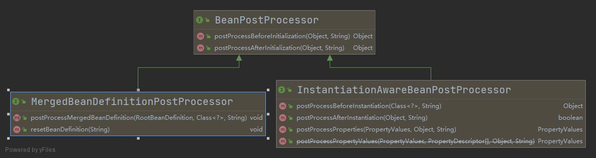

- [Spring Bean 生命周期](#spring-bean-生命周期)
    - [生命周期](#生命周期)
    - [关键接口说明](#关键接口说明)
        - [相关Aware接口](#相关aware接口)
        - [`BeanPostProcessor`](#beanpostprocessor)
        - [初始化方法](#初始化方法)
            - [`@PostConstruct`](#postconstruct)
            - [XML中定义的init-method](#xml中定义的init-method)
    - [销毁bean](#销毁bean)

# Spring Bean 生命周期

## 生命周期

## 关键接口说明

### 相关Aware接口

Aware接口很好理解，其实就是向spring bean中注入相关的对象实例

### `BeanPostProcessor`

`MergedBeanDefinitionPostProcessor`和`InstantiationAwareBeanPostProcessor`都继承`BeanPostProcessor`接口

下面对这些接口的功能进行简单描述

1. `InstantiationAwareBeanPostProcessor#postProcessBeforeInstantiation(Class<?> beanClass, String beanName)`
   可以使用返回值替换bean, 即返回的bean就是IOC容器中缓存的bean，返回值不为null, 不会执行上图中该方法之后的方法了

2. `MergedBeanDefinitionPostProcessor#postProcessMergedBeanDefinition(RootBeanDefinition beanDefinition, Class<?> beanType, String beanName)`
   把RootBeanDefinition传过来，可以修改该RootBeanDefinition

3. `InstantiationAwareBeanPostProcessor#postProcessAfterInstantiation(Object bean, String beanName)`
   bean实例化之后, 返回true即需要设置properties，否则不会设置properties, 包括自动注入的属性

4. `InstantiationAwareBeanPostProcessor#postProcessProperties(PropertyValues pvs, Object bean, String beanName)`
   可以修改属性值，如果不需要修改就返回null, 否则实际返回的就是修改后的属性值

5. `InstantiationAwareBeanPostProcessor#postProcessPropertyValues(PropertyValues pvs, PropertyDescriptor[] pds, Object bean, String beanName)`
   spring5.1之后即废弃该方法, 而在postProcessProperties中返回属性值

6. `BeanPostProcessor#postProcessBeforeInitialization(Object bean, String beanName)`
   bean实例化和初始化之后，初始化方法执行之前，可以修改bean，比如返回一个包装类，如果不需要修改bean则返回原bean实例

7. `InitializingBean#afterPropertiesSet()`
   `@PostConstruct`方法执行之后

8. `BeanPostProcessor#postProcessAfterInitialization(Object bean, String beanName)`
   bean的初始化方法执行之后，可以修改bean，比如返回一个包装类，如果不需要修改bean则返回原bean实例

### 初始化方法

#### `@PostConstruct`

`@PostConstruct`注解的初始化方法，执行时bean的属性都已经注入了, 但是仍然存在bean的某个属性只是实例化了，但是并没有初始化的可能性

#### XML中定义的init-method

和`@PostConstruct`注解的初始化方法类似，执行时间在`@PostConstruct`注解的方法之后，执行时bean的属性都已经注入了, 但是仍然存在bean的某个属性只是实例化了，但是并没有初始化的可能性

## 销毁bean

销毁bean时，spring也提供了回调接口，主要包括如下三个：

1. `@PreDestroy`
2. `DisposableBean#destroy()`
3. `XML中定义的destroy-method`

