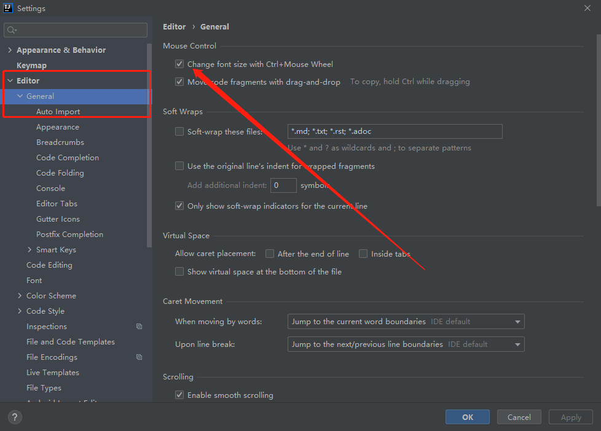
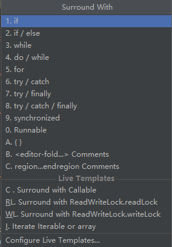

- [IDEA常用操作](#idea常用操作)
  - [1. 设置类](#1-设置类)
    - [1.1 设置Ctrl+滚轮 放大/缩小 编辑窗口](#11-设置ctrl滚轮-放大缩小-编辑窗口)
  - [2. 快捷键](#2-快捷键)
    - [2.1 编辑区](#21-编辑区)
    - [2.2 导航区](#22-导航区)

# IDEA常用操作

## 1. 设置类

### 1.1 设置Ctrl+滚轮 放大/缩小 编辑窗口

## 2. 快捷键

下文整理的是windows/linux的格式的快捷键

### 2.1 编辑区

1. Ctrl + P  查看方法参数
2. Ctrl + Q  查看方法的JavaDoc
3. Alt  + Insert 插入代码

4. Ctrl + O 插入重写方法
5. Ctrl + I 实现方法
6. Ctrl + Alt + T Surround With: 包括代码块

4. Crl + / 单行注释 or 取消单行注释
5. Ctrl + Shift + / 多行注释 or 取消多行注释
6. Ctrl + Alt + L 格式化代码
7.  Ctrl + Alt + O 自动去除多余的import
8.  Ctrl + Alt + I 自动缩进
9.  Tab 向后缩进1个制表符
10. Shift + Tab 向前缩进1个制表符
11. Ctrl + X 剪切当前行
12. Ctrl + C 复制当前行
13. Ctrl + V 粘贴
14. Ctrl + Shift + V 复制的内容的历史记录
15. Ctrl + D 复制当前行到下一行
16. Ctrl + Y 删除当前行
17. Ctrl + Shift + [ 选择当前位置到上一个{的代码
18. Ctrl + Shift + ] 选择当前位置到下一个}的代码
19. Ctrl + Shift + U 大小写转换
20. Ctrl + Delete 删除当前光标后的一个单词、空格等
21. Ctrl + Backspace 删除当前光标前的一个单词、空格等
22. Ctrl + '+' 展开当前光标所在代码块
23. Ctrl + '-' 关闭当前光标所在代码块
24. Ctrl + Shift + '+'  展开所有代码块
25. Ctrl + Shift + '-'  关闭所有代码块
26. Ctrl + F4 关闭所有编辑的文件

### 2.2 导航区

