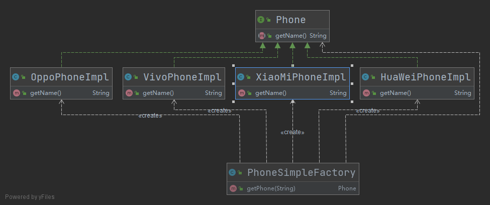
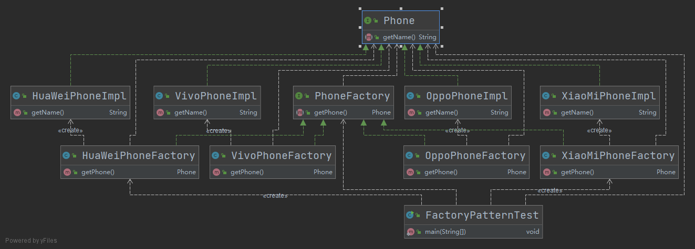

- [工厂模式](#工厂模式)
  - [1. 简单工厂](#1-简单工厂)
    - [1.1 简单工厂实现](#11-简单工厂实现)
    - [1.2 简单工厂的优缺点](#12-简单工厂的优缺点)
  - [2. 工厂方法](#2-工厂方法)
    - [2.2.1 工厂方法实现](#221-工厂方法实现)
    - [2.2.2 工厂方法优缺点](#222-工厂方法优缺点)
  - [2.3 抽象工厂](#23-抽象工厂)
    - [2.3.2 抽象工厂优缺点](#232-抽象工厂优缺点)
  - [2.4 三种工厂方法的适用场景](#24-三种工厂方法的适用场景)
# 工厂模式

工厂模式提供了一种简单、快速、高效且安全地创建对象的方式， 工厂方法不直接创建对象，而将创建对象的过程放到对应的工厂类中实现， 如果后续需要修改对象， 只需更改工厂即可。

工厂模式可以分为三种：

- 简单工厂
- 工厂方法
- 抽象工厂

## 1. 简单工厂

### 1.1 简单工厂实现

在此以手机为例说明工厂方法，手机的品牌有华为、 小米、 VIVO、 OPPO等。 

我们的需求是：根据客户传入的手机品牌名字来实例化一个手机对象。

如果是常规的写法， 我们需要根据传入的手机品牌名字来进行判断(if - else)，这样的就会导致代码中存在大量的if-else分支， 这样很不利于维护。 简单工厂的设计思想即是将实例化对象的过程放到工厂类中， 当我们需要对象时直接调用工厂类即可获取对象。

看下UML类图



```java

1. 手机接口

/**
 * 手机接口
 *
 * @author Young
 * @Date 2021-03-27 22:13
 */
public interface Phone {
    /**
     * 返回手机名
     *
     * @return
     */
    String getName();
}

2. 各个手机对象， 包含华为、 小米、 VIVO、 OPPO

/**
 * 华为手机
 *
 * @author Young
 * @Date 2021-03-27 22:13
 */
public class HuaWeiPhoneImpl implements Phone {
    @Override
    public String getName() {
        return "我是华为手机";
    }
}

/**
 * 小米手机
 *
 * @author Young
 * @Date 2021-03-27 22:09
 */
public class XiaoMiPhoneImpl implements Phone {
    @Override
    public String getName() {
        return "我是小米手机";
    }
}

/**
 * Vivo手机
 *
 * @author Young
 * @Date 2021-03-27 22:11
 */
public class VivoPhoneImpl implements Phone {
    @Override
    public String getName() {
        return "我是VIVO手机";
    }
}

/**
 * OPPO手机
 *
 * @author Young
 * @Date 2021-03-27 22:23
 */
public class OppoPhoneImpl implements Phone {
    @Override
    public String getName() {
        return "我是OPPO手机";
    }
}

3. 手机工厂

/**
 * 手机工厂--简单工厂
 *
 * @author Young
 * @Date 2021-03-27 22:25
 */
public class PhoneSimpleFactory {

    public Phone getPhone(String phoneName) {
        switch (phoneName) {
            case "VIVO":
                return new VivoPhoneImpl();
            case "XiaoMi":
                return new XiaoMiPhoneImpl();
            case "HuaWei":
                return new HuaWeiPhoneImpl();
            case "OPPO":
                return new OppoPhoneImpl();
            default:
                return null;
        }
    }

}

4. 简单工厂的使用

/**
 * 简单工厂测试
 *
 * @author Young
 * @Date 2021-03-27 22:30
 */
public class SimpleFactoryTest {

    public static void main(String[] args) {
        PhoneSimpleFactory phoneSimpleFactory = new PhoneSimpleFactory();
        Phone phone = phoneSimpleFactory.getPhone("HuaWei");
        if (Objects.nonNull(phone)) {
            System.out.println("PhoneName: " + phone.getName());
        }
    }

}

```

### 1.2 简单工厂的优缺点

**优点**

- 使用简单，只有一个工厂类，这个工厂能够生产多种产品

**缺点**

- 当产品较多时，工厂类会变得很庞大，而且任何一个产品的修改都会修改到该工厂类， 违反了单一职责原则；
- 当新增一个产品时，需要在工厂类中新增一个分支，违反了开闭原则。


## 2. 工厂方法

上文说简单工厂方法，当产品较多时，工厂类会变得很庞大，而且新增产品时，工厂类需要新增分支，违反单一职责原则和开闭原则。而工厂模式可以解决该问题。

### 2.2.1 工厂方法实现

还是以手机为例，与简单工厂不同， 工厂方法要求每个手机都要有自己的工厂类，当我们需要手机对象时，直接从对应的工厂中取即可。在手机的例子中，HuaWeiPhone有其对应的HuaWeiPhoneFactory工厂类， XiaoMiPhone有其对应的XiaoMiPhoneFactory工厂类，UML类图如下：



```java

1. 手机接口和各手机对象的定义见简单工厂

2. 工厂接口

/**
 * 手机工厂接口
 *
 * @author Young
 * @Date 2021-03-27 22:35
 */
public interface PhoneFactory {
    /**
     * 返回手机对象
     *
     * @return
     */
    Phone getPhone();
}

3. 各工厂类

/**
 * 华为手机工厂
 * @author Young
 * @Date 2021-03-27 22:34
 */
public class HuaWeiPhoneFactory implements PhoneFactory{

    @Override
    public Phone getPhone(){
        return new HuaWeiPhoneImpl();
    }

}

/**
 * 小米手机工厂
 *
 * @author Young
 * @Date 2021-03-27 22:35
 */
public class XiaoMiPhoneFactory implements PhoneFactory {


    @Override
    public Phone getPhone() {
        return new XiaoMiPhoneImpl();
    }
}

/**
 * OPPO手机工厂
 *
 * @author Young
 * @Date 2021-03-27 22:38
 */
public class OppoPhoneFactory implements PhoneFactory {
    @Override
    public Phone getPhone() {
        return new OppoPhoneImpl();
    }
}

/**
 * VIVO手机工厂
 *
 * @author Young
 * @Date 2021-03-27 22:40
 */
public class VivoPhoneFactory implements PhoneFactory {
    @Override
    public Phone getPhone() {
        return new VivoPhoneImpl();
    }
}

4. 工厂方法使用

/**
 * 工厂方法测试类
 *
 * @author Young
 * @Date 2021-03-27 22:40
 */
public class FactoryPatternTest {

    public static void main(String[] args) {
        // 从华为手机工厂中取华为手机
        PhoneFactory huaWeiPhoneFactory = new HuaWeiPhoneFactory();
        Phone huaWeiPhone = huaWeiPhoneFactory.getPhone();
        System.out.println(huaWeiPhone.getName());

        // 从小米手机工厂中取小米手机
        PhoneFactory xiaoMiPhoneFactory = new XiaoMiPhoneFactory();
        Phone xiaoMiPhone = xiaoMiPhoneFactory.getPhone();
        System.out.println(xiaoMiPhone.getName());

    }

}

```

### 2.2.2 工厂方法优缺点

**优点**

- 工厂类只负责生产对应的产品，符合单一职责原则；
- 新增产品时，需要新增一个工厂类，符合开闭原则。

**缺点**

- 使用时需要知道具体的工厂类

## 2.3 抽象工厂

抽象工厂模式在工厂模式上添加了一个创建不同工厂的抽象接口(抽象类或者接口)，该接口可叫做超级工厂。在使用时， 首先根据不同的工厂接口创建不同的工厂对象，然后根据不同的工厂对象创建不同的对象。

可以将工厂模式理解为针对一个产品维度进行分类，比如简单工厂和工厂方法中的手机对象。而抽象工厂模式针对的是多个产品维度分类，比如华为即生产手机也生产电脑。

在同一个公司有多个维度的产品时，如果使用工厂模式，则势必会存在多个独立的工厂，即华为手机工厂和华为电脑工厂，而这样的设计和实际的物理世界是不对称的，这个问题可以通过抽象工厂方法来实现。可以将抽象工厂类比作公司(华为、小米)，将抽象工厂创建出来的工厂类比作产品(手机和电脑)，生产产品时根据抽象工厂进行生产， 看下UML类图：


```java

1. 手机接口和其实现类见上文

2. 电脑接口和其实现类

/**
 * 电脑接口
 *
 * @author Young
 * @Date 2021-03-28 13:13
 */
public interface Computer {

    /**
     * 返回电脑
     *
     * @return
     */
    String getName();

}

/**
 * 华为电脑
 * @author Young
 * @Date 2021-03-28 13:18
 */
public class HuaWeiComputerImpl implements Computer {
    @Override
    public String getName() {
        return "我是华为笔记本电脑";
    }
}

/**
 * 小米笔记本
 *
 * @author Young
 * @Date 2021-03-28 13:19
 */
public class XiaoMiComputerImpl implements Computer {
    @Override
    public String getName() {
        return "我是小米笔记本";
    }
}

3. 抽象工厂接口

/**
 * 电子产品工厂(超级工厂)
 *
 * @author Young
 * @Date 2021-03-28 13:12
 */
public interface ElectronicGoodsFactory {

    /**
     * 制造手机
     *
     * @param phoneName
     * @return
     */
    Phone getPhone(String phoneName);

    /**
     * 制造电脑
     *
     * @param computerName
     * @return
     */
    Computer getComputer(String computerName);

}

4. 手机简单工厂

/**
 * 手机工厂
 *
 * @author Young
 * @Date 2021-03-28 13:15
 */
public class PhoneFactory implements ElectronicGoodsFactory {
    @Override
    public Phone getPhone(String phoneName) {
        switch (phoneName) {
            case "VIVO":
                return new VivoPhoneImpl();
            case "XiaoMi":
                return new XiaoMiPhoneImpl();
            case "HuaWei":
                return new HuaWeiPhoneImpl();
            case "OPPO":
                return new OppoPhoneImpl();
            default:
                return null;
        }
    }

    @Override
    public Computer getComputer(String computerName) {
        return null;
    }
}

5. 电脑简单工厂

/**
 * 电脑工厂
 *
 * @author Young
 * @Date 2021-03-28 13:17
 */
public class ComputerFactory implements ElectronicGoodsFactory {
    @Override
    public Phone getPhone(String phoneName) {
        return null;
    }

    @Override
    public Computer getComputer(String computerName) {
        switch (computerName) {
            case "HuaWei":
                return new HuaWeiComputerImpl();
            case "XiaoMi":
                return new XiaoMiComputerImpl();
            default:
                return null;
        }
    }
}

6. 抽象工厂测试类

/**
 * 抽象工厂测试类
 * @author Young
 * @Date 2021-03-28 13:22
 */
public class AbstractFactoryTest {

    public static void main(String[] args) {
        // 制造华为电脑
        ElectronicGoodsFactory computerFactory = new ComputerFactory();
        Computer huaWeiComputer = computerFactory.getComputer("HuaWei");
        System.out.println(huaWeiComputer.getName());

        // 制造华为手机
        ElectronicGoodsFactory phoneFactory = new PhoneFactory();
        Phone huaWeiPhone = phoneFactory.getPhone("HuaWei");
        System.out.println(huaWeiPhone.getName());
    }
}

```

### 2.3.2 抽象工厂优缺点

**优点**

- 适用于不同维度的产品(不仅有手机，还有电脑)，可横向扩展产品以及产品种类

**缺点**

- 如果抽象工厂接口需要新增功能，则会影响所有的工厂实现类

## 2.4 三种工厂方法的适用场景

- **简单工厂**: 用来生产同一等级结构中的任意产品。（不支持拓展增加产品）
- **工厂方法**: 用来生产同一等级结构中的固定产品。（支持拓展增加产品）  
- **抽象工厂**: 用来生产不同产品族的全部产品。（支持拓展增加产品；支持增加产品族）