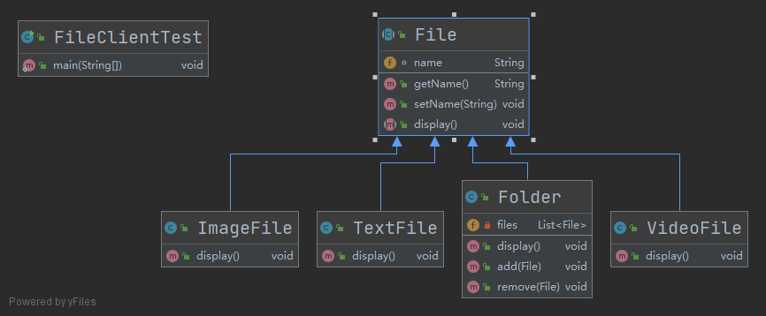

- [组合模式](#组合模式)
  - [1. 优缺点](#1-优缺点)
  - [2. 组合模式适用场景](#2-组合模式适用场景)
  - [3. Java实例](#3-java实例)

# 组合模式

组合模式(Composite Pattern)又被称为部分整体模式，主要用于实现部分和整体操作的一致性。组合模式常根据树形结构来表示部分和整体之间的关系，使得用户对单个对象和组合对象的操作具有一致性。组合模式通过特定的数据结构简化了部分和整体之间的关系，使得客户端可以像处理单个元素一样来处理整体的数据集，而无需关心单个元素和整体数据集之间的内部复杂结构

## 1. 优缺点

**优点**

- 组合模式使得客户端代码可以一致地处理单个对象和组合对象，无须关心自己处理的是单个对象，还是组合对象，这简化了客户端代码；
- 更容易在组合体内加入新的对象，客户端不会因为加入了新的对象而更改源代码，满足“开闭原则”；


**缺点**

- 使设计变得更加抽象，对象的业务规则如果很复杂，则实现组合模式具有很大挑战性，而且不是所有的方法都与叶子对象子类都有关联

## 2. 组合模式适用场景

- 需要表示一个对象整体或部分层次，在具有整体和部分的层次结构中，希望通过一种方式忽略整体与部分的差异，可以一致地对待它们。
- 让客户能够忽略不同对象层次的变化，客户端可以针对抽象构件编程，无须关心对象层次结构的细节。

## 3. Java实例



```java

/**
 * File抽象类
 *
 * @author Young
 * @Date 2021-06-14 10:28
 */
public abstract class File {

    String name;

    public File(String name) {
        this.name = name;
    }

    public String getName() {
        return name;
    }

    public void setName(String name) {
        this.name = name;
    }

    /**
     * 显示文件属性
     */
    public abstract void display();

}

import java.util.ArrayList;
import java.util.List;

/**
 * 该类包含对文件的增加、删除和浏览三个方法
 *
 * @author Young
 * @Date 2021-06-14 10:29
 */
public class Folder extends File {

    private List<File> files;

    public Folder(String name) {
        super(name);
        files = new ArrayList<File>();
    }

    /**
     * 浏览文件夹中的文件
     */
    @Override
    public void display() {
        for (File file : files) {
            file.display();
        }
    }

    /**
     * 向文件夹中添加文件
     *
     * @param file
     * @return void
     */
    public void add(File file) {
        files.add(file);
    }

    /**
     * 从文件夹中删除文件
     *
     * @param file
     * @return void
     */
    public void remove(File file) {
        files.remove(file);
    }

}

/**
 * 文本文件
 *
 * @author Young
 * @Date 2021-06-14 10:32
 */
public class TextFile extends File{

    public TextFile(String name) {
        super(name);
    }

    @Override
    public void display() {
        System.out.println("这是文本文件，文件名：" + super.getName());
    }
}

/**
 * 视频文件
 *
 * @author Young
 * @Date 2021-06-14 10:36
 */
public class VideoFile extends File {

    public VideoFile(String name) {
        super(name);
    }

    @Override
    public void display() {
        System.out.println("这是影像文件，文件名：" + super.getName());
    }

}

/**
 * 图像文件
 *
 * @author Young
 * @Date 2021-06-14 10:35
 */
public class ImageFile extends File{

    public ImageFile(String name) {
        super(name);
    }

    @Override
    public void display() {
        System.out.println("这是图像文件，文件名：" + super.getName());
    }
}


/**
 * 组合模式测试类
 *
 * @author Young
 * @Date 2021-06-14 10:37
 */
public class FileClientTest {

    public static void main(String[] args) {
        //总文件夹
        Folder folder = new Folder("总文件夹");
        //向总文件夹中放入三个文件：a.txt、b.jpg、c文件夹
        TextFile aText = new TextFile("a.txt");
        ImageFile bImage = new ImageFile("b.jpg");
        Folder cFolder = new Folder("C文件夹");

        folder.add(aText);
        folder.add(bImage);
        folder.add(cFolder);

        //向C文件夹中添加文件：c_1.txt、c_1.rmvb、c_1.jpg
        TextFile cText = new TextFile("c_1.txt");
        ImageFile cImage = new ImageFile("c_1.jpg");
        VideoFile cVideo = new VideoFile("c_1.rmvb");

        cFolder.add(cText);
        cFolder.add(cImage);
        cFolder.add(cVideo);

        //遍历总文件夹
        folder.display();
        //将c_1.txt删除
        cFolder.remove(cText);
        System.out.println("-----------------------");
        // 再遍历总文件夹
        folder.display();
    }
}


```

