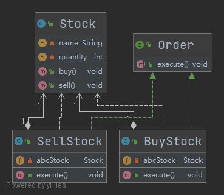

- [命令模式](#命令模式)
    - [1. 优缺点](#1-优缺点)
    - [2. Java实例](#2-java实例)

# 命令模式

命令模式指将请求封装为命令，基于时间驱动异步地执行，以实现命令的发送者和命令的执行者之间的解耦，提高命令发送、执行的效率和灵活度

命令模式将命令调用者与执行者解耦，有效降低系统的耦合度，增加和删除命令也非常方便

认为是命令的地方都可以使用命令模式，比如： 1、GUI 中每一个按钮都是一条命令。 2、模拟 CMD。

命令模式包含以下主要角色：

- 抽象命令类(Command) : 执行命令的接口，定义执行命令的抽象方法execute()
- 具体命令类(Concrete Command) : 抽象命令类的实现类，持有接收者对象，并在接受到命令后调用命令执行者的方法action()实现命令的调用和执行
- 命令执行者(Receiver) : 命令的具体执行者，定义了命令执行的具体方法action()
- 命令调用者(Invoker) : 接收客户端的命令并异步执行

## 1. 优缺点

**优点：**

- 降低了系统耦合度，命令模式能将调用操作的对象与实现该操作的对象解耦
- 增加或删除命令非常方便。采用命令模式增加与删除命令不会影响其他类，它满足“开闭原则”，对扩展比较灵活。

**缺点：**

- 使用命令模式可能会导致某些系统有过多的具体命令类。

## 2. Java实例



```java

/**
 * Stock请求类
 *
 * @author Young
 * @Date 2021-06-19 14:05
 */
public class Stock {

    private String name = "ABC";

    private int quantity = 10;

    public void buy(){
        System.out.println("Stock [ Name: "+name+", Quantity: " + quantity +" ] bought");
    }
    public void sell(){
        System.out.println("Stock [ Name: "+name+", Quantity: " + quantity +" ] sold");
    }
}


/**
 * 命令接口
 *
 * @author Young
 * @Date 2021-06-19 14:06
 */
public interface Order {
    /**
     * 命令执行
     */
    void execute();
}

/**
 * 卖股票的命令类
 *
 * @author Young
 * @Date 2021-06-19 14:09
 */
public class SellStock implements Order {
    private Stock abcStock;

    public SellStock(Stock abcStock) {
        this.abcStock = abcStock;
    }

    @Override
    public void execute() {
        abcStock.sell();
    }
}

/**
 * 买股票的命令实现
 *
 * @author Young
 * @Date 2021-06-19 14:07
 */
public class BuyStock implements Order {

    private Stock abcStock;

    public BuyStock(Stock abcStock) {
        this.abcStock = abcStock;
    }

    @Override
    public void execute() {
        abcStock.buy();
    }
}

/**
 * 创建命令类
 *
 * @author Young
 * @Date 2021-06-19 14:09
 */
public class Broker {

    private List<Order> orderList = new ArrayList<Order>();

    public void takeOrder(Order order) {
        orderList.add(order);
    }

    public void executeOrder() {
        for (Order order : orderList) {
            order.execute();
        }
        orderList.clear();
    }
}

/**
 * 命令模式测试类
 *
 * @author Young
 * @Date 2021-06-19 14:11
 */
public class CommandPatternDemo {
    public static void main(String[] args) {
        Stock abcStock = new Stock();

        BuyStock buyStockOrder = new BuyStock(abcStock);
        SellStock sellStockOrder = new SellStock(abcStock);

        // 接受命令
        Broker broker = new Broker();
        broker.takeOrder(buyStockOrder);
        broker.takeOrder(sellStockOrder);

        //执行命令
        broker.executeOrder();
    }
}

```
