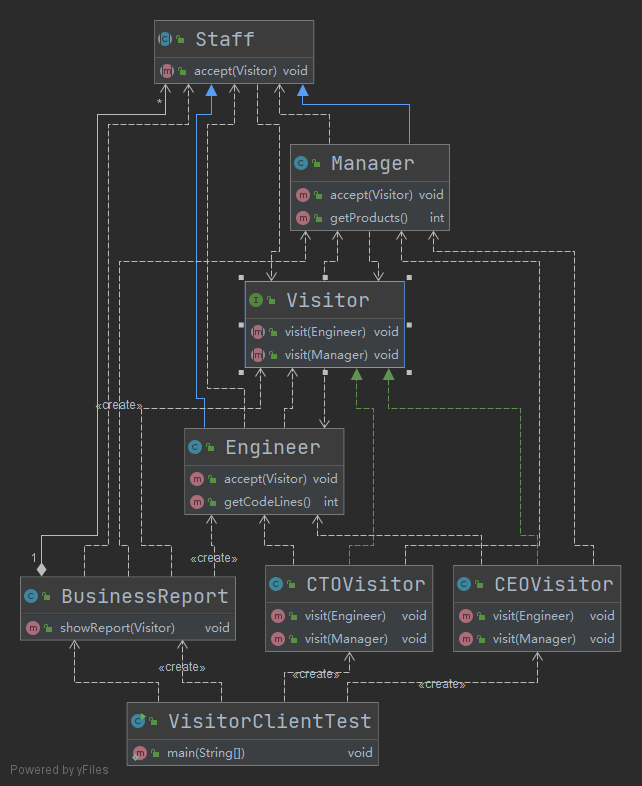

- [访问者模式](#访问者模式)
  - [1. 优缺点](#1-优缺点)
  - [2. Java实例](#2-java实例)

# 访问者模式

在现实生活中，有些集合对象中存在多种不同的元素，且每种元素也存在多种不同的访问者和处理方式。例如，公园中存在多个景点，也存在多个游客，不同的游客对同一个景点的评价可能不同；医院医生开的处方单中包含多种药元素，査看它的划价员和药房工作人员对它的处理方式也不同，划价员根据处方单上面的药品名和数量进行划价，药房工作人员根据处方单的内容进行抓药。

这样的例子还有很多，例如，电影或电视剧中的人物角色，不同的观众对他们的评价也不同；还有顾客在商场购物时放在“购物车”中的商品，顾客主要关心所选商品的性价比，而收银员关心的是商品的价格和数量。

这些被处理的数据元素相对稳定而访问方式多种多样的数据结构，如果用“访问者模式”来处理比较方便。访问者模式能把处理方法从数据结构中分离出来，并可以根据需要增加新的处理方法，且不用修改原来的程序代码与数据结构，这提高了程序的扩展性和灵活性。

访问者（Visitor）模式的定义：将作用于某种数据结构中的各元素的操作分离出来封装成独立的类，使其在不改变数据结构的前提下可以添加作用于这些元素的新的操作，为数据结构中的每个元素提供多种访问方式。它将对数据的操作与数据结构进行分离，是行为类模式中最复杂的一种模式。

**意图：**主要将数据结构与数据操作分离。

**主要解决：**稳定的数据结构和易变的操作耦合问题。

**何时使用：**需要对一个对象结构中的对象进行很多不同的并且不相关的操作，而需要避免让这些操作"污染"这些对象的类，使用访问者模式将这些封装到类中。

## 1. 优缺点

**优点：** 

- 符合单一职责原则
- 优秀的扩展性
- 灵活性

**缺点：** 

- 具体元素对访问者公布细节，违反了迪米特原则
- 具体元素变更比较困难
- 违反了依赖倒置原则，依赖了具体类，没有依赖抽象

## 2. Java实例

年底，CEO和CTO开始评定员工一年的工作绩效，员工分为工程师和经理，CTO关注工程师的代码量、经理的新产品数量；CEO关注的是工程师的KPI和经理的KPI以及新产品数量。
 由于CEO和CTO对于不同员工的关注点是不一样的，这就需要对不同员工类型进行不同的处理。访问者模式此时可以派上用场了。

 

```java
/**
 * 员工基类  Staff 类定义了员工基本信息及一个 accept 方法，accept 方法表示接受访问者的访问，由子类具体实现。Visitor 是个接口，传入不同的实现类，可访问不同的数据。
 *
 * @author Young
 * @Date 2021-06-20 19:57
 */
public abstract class Staff {

    public String name;

    /**
     * 员工KPI
     */
    public int kpi;

    public Staff(String name) {
        this.name = name;
        kpi = new Random().nextInt(10);
    }

    /**
     * 核心方法，接受Visitor的访问
     *
     * @param visitor
     */
    public abstract void accept(Visitor visitor);

}

/**
 * 工程师
 *
 * @author Young
 * @Date 2021-06-20 19:59
 */
public class Engineer extends Staff {
    public Engineer(String name) {
        super(name);
    }

    @Override
    public void accept(Visitor visitor) {
        visitor.visit(this);
    }

    /**
     * 工程师一年的代码数量
     *
     * @return
     */
    public int getCodeLines() {
        return new Random().nextInt(10 * 10000);
    }
}

/**
 * 经理
 *
 * @author Young
 * @Date 2021-06-20 20:00
 */
public class Manager extends Staff {

    public Manager(String name) {
        super(name);
    }

    @Override
    public void accept(Visitor visitor) {
        visitor.visit(this);
    }

    /**
     * 一年做的产品数量
     */
    public int getProducts() {
        return new Random().nextInt(10);
    }
}

//工程师是代码数量，经理是产品数量，他们的职责不一样，也就是因为差异性，才使得访问模式能够发挥它的作用。Staff、Engineer、Manager 3个类型就是对象结构，这些类型相对稳定，不会发生变化。


//然后将这些员工添加到一个业务报表类中，公司高层可以通过该报表类的 showReport 方法查看所有员工的业绩，具体代码如下：

import java.util.LinkedList;
import java.util.List;

/**
 * 员工业务报表类
 *
 * @author Young
 * @Date 2021-06-20 20:02
 */
public class BusinessReport {
    private List<Staff> mStaffs = new LinkedList<>();

    public BusinessReport() {
        mStaffs.add(new Manager("经理-A"));
        mStaffs.add(new Engineer("工程师-A"));
        mStaffs.add(new Engineer("工程师-B"));
        mStaffs.add(new Engineer("工程师-C"));
        mStaffs.add(new Manager("经理-B"));
        mStaffs.add(new Engineer("工程师-D"));
    }

    /**
     * 为访问者展示报表
     *
     * @param visitor 公司高层，如CEO、CTO
     */
    public void showReport(Visitor visitor) {
        for (Staff staff : mStaffs) {
            staff.accept(visitor);
        }
    }
}

/**
 * 定义了一个 Visitor 接口，该接口有两个 visit 函数，参数分别是 Engineer、Manager，也就是说对于 Engineer、Manager 的访问会调用两个不同的方法，以此达成区别对待、差异化处理。
 *
 * @author Young
 * @Date 2021-06-20 20:04
 */
public interface Visitor {
    /**
     * 访问工程师类型
     *
     * @param engineer
     */
    void visit(Engineer engineer);

    /**
     * 访问经理类型
     *
     * @param manager
     */
    void visit(Manager manager);
}

/**
 * CEO访问者
 *
 * @author Young
 * @Date 2021-06-20 20:05
 */
public class CEOVisitor implements Visitor {
    @Override
    public void visit(Engineer engineer) {
        System.out.println("工程师: " + engineer.name + ", KPI: " + engineer.kpi);
    }

    @Override
    public void visit(Manager manager) {
        System.out.println("经理: " + manager.name + ", KPI: " + manager.kpi +
                ", 新产品数量: " + manager.getProducts());
    }
}


/**
 * CTO访问者
 *
 * @author Young
 * @Date 2021-06-20 20:06
 */
public class CTOVisitor implements Visitor {
    @Override
    public void visit(Engineer engineer) {
        System.out.println("工程师: " + engineer.name + ", 代码行数: " + engineer.getCodeLines());
    }

    @Override
    public void visit(Manager manager) {
        System.out.println("经理: " + manager.name + ", 产品数量: " + manager.getProducts());
    }
}

//在CEO的访问者中，CEO关注工程师的 KPI，经理的 KPI 和新产品数量，通过两个 visitor 方法分别进行处理。如果不使用 Visitor 模式，只通过一个 visit 方法进行处理，那么就需要在这个 visit 方法中进行判断，然后分别处理，代码大致如下：

public class ReportUtil {
    public void visit(Staff staff) {
        if (staff instanceof Manager) {
            Manager manager = (Manager) staff;
            System.out.println("经理: " + manager.name + ", KPI: " + manager.kpi +
                    ", 新产品数量: " + manager.getProducts());
        } else if (staff instanceof Engineer) {
            Engineer engineer = (Engineer) staff;
            System.out.println("工程师: " + engineer.name + ", KPI: " + engineer.kpi);
        }
    }
}

//这就导致了 if-else 逻辑的嵌套以及类型的强制转换，难以扩展和维护，当类型较多时，这个 ReportUtil 就会很复杂。使用 Visitor 模式，通过同一个函数对不同对元素类型进行相应对处理，使结构更加清晰、灵活性更高。

/**
 * 访问者模式测试
 *
 * @author Young
 * @Date 2021-06-20 20:07
 */
public class VisitorClientTest {
    public static void main(String[] args) {
        // 构建报表
        BusinessReport report = new BusinessReport();
        System.out.println("=========== CEO看报表 ===========");
        report.showReport(new CEOVisitor());
        System.out.println("=========== CTO看报表 ===========");
        report.showReport(new CTOVisitor());
    }
}


//输出
=========== CEO看报表 ===========
经理: 经理-A, KPI: 9, 新产品数量: 0
工程师: 工程师-A, KPI: 6
工程师: 工程师-B, KPI: 6
工程师: 工程师-C, KPI: 8
经理: 经理-B, KPI: 2, 新产品数量: 6
工程师: 工程师-D, KPI: 6
=========== CTO看报表 ===========
经理: 经理-A, 产品数量: 3
工程师: 工程师-A, 代码行数: 62558
工程师: 工程师-B, 代码行数: 92965
工程师: 工程师-C, 代码行数: 58839
经理: 经理-B, 产品数量: 6
工程师: 工程师-D, 代码行数: 53125
```

注：访问者模式参考https://www.jianshu.com/p/1f1049d0a0f4