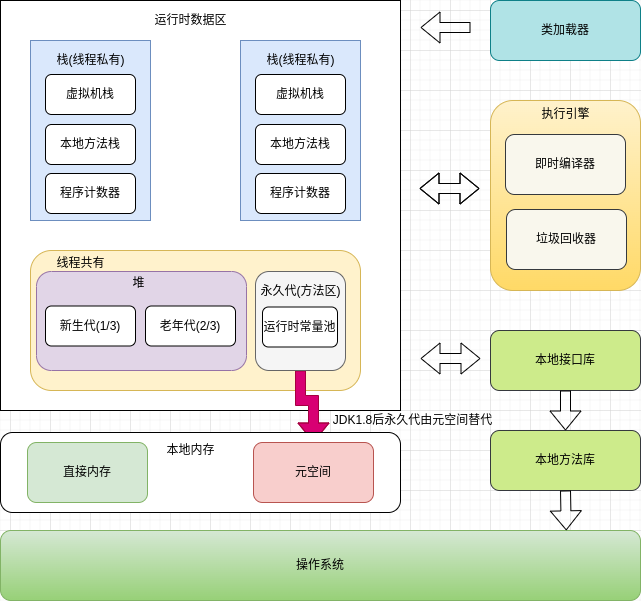
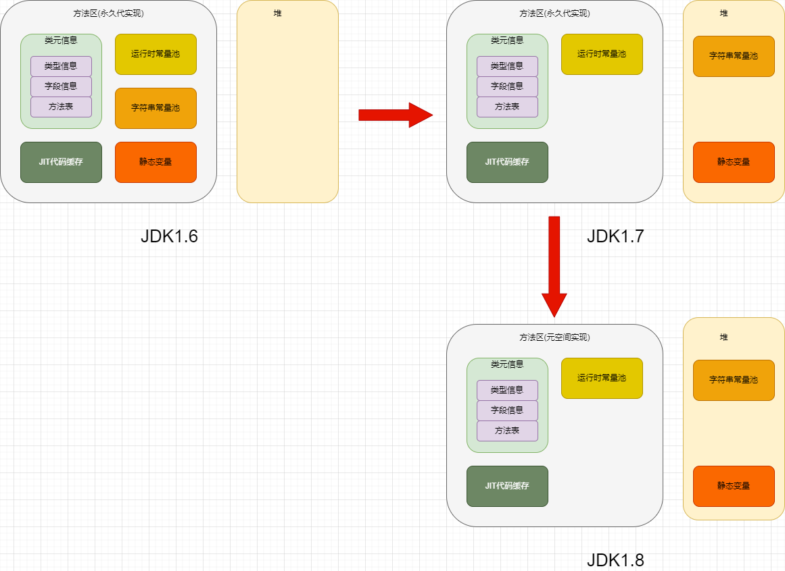

# JVM运行时数据区

## JVM运行机制



JVM是用于运行Java字节码的虚拟机，包括字节码指令集、程序寄存器、虚拟机栈、虚拟机堆、方法区和垃圾回收器。JVM屏蔽了操作系统的差异，能够跨平台运行，其运行在操作系统之上，不与硬件系统直接交互。

Java源文件(.java)在通过编译器之后被编译成相应的字节码文件(.class)，字节码文件又被JVM中的解释器编译成机器码后在操作系统上运行。每种操作系统的解释器都是不同的。

如上图所示，JVM包括一个类加载器子系统、运行时数据区、执行引擎和本地接口库。本地接口库通过调用本地方法库与操作系统交互。

下面我们将依次说明对JVM各组成部分的关键知识点

## JVM的内存区域

JVM的内存区域分为线程私有（虚拟机栈、程序计数器、本地方法栈），线程共享（堆、方法区）和直接内存

- 线程私有区域的生命周期与线程相同，每个线程都与操作系统的本地线程直接映射。
- 线程共享区域随虚拟机的启动而创建，随虚拟的关闭而销毁。
- 直接内存也叫做堆外内存、其并不是JVM运行时数据区的一部分，但是JVM内存区域的重要组成部分。Java通过堆外内存避免在Java堆和Native堆中来回复制数据带来的资源浪费和性能消耗，因此堆外内存在高并发应用场景下被广泛使用(JavaNIO, Netty)

### 程序计数器

程序计数器是一块较小的内存空间，可以看作是当前线程所执行的字节码的行号指示器。字节码解释器工作时通过改变这个计数器的值来选取下一条需要执行的字节码指令，分支、循环、跳转、异常处理、线程恢复等功能都需要依赖这个计数器来完成。

如果该方法执行的是native方法，那么程序计数器的值为空(Undefined)

程序计数器属于线程私有的内存区域，唯一一个没有内存溢出(Out Of Memory)的区域

程序计数器主要有两个作用：
- 字节码解释器通过改变程序计数器来依次读取指令，从而实现代码的流程控制，如：顺序执行、选择、循环、异常处理。
- 在多线程的情况下，程序计数器用于记录当前线程执行的位置，从而当线程被切换回来的时候能够知道该线程上次运行到哪儿了。

### 虚拟机栈

虚拟机栈是描述Java方法的执行过程的内存模型，由栈帧组成。当前栈帧中存储了本地变量表，操作数栈、动态链接和方法出口等信息。同时栈帧用来存储部分运行时数据及其数据结构，处理动态链接方法的返回值和异常分发。

栈帧用来记录方法的执行过程，在方法被执行时虚拟机会为其创建一个与之对应的栈帧，方法的执行和返回对应栈帧在虚拟机栈中的入栈和出栈，每个运行中的线程只有一个栈帧处于活动状态。

Java 方法有两种返回方式，一种是 return 语句正常返回，一种是抛出异常。不管哪种返回方式，都会导致栈帧被弹出。也就是说， 栈帧随着方法调用而创建，随着方法结束而销毁。无论方法正常完成还是异常完成都算作方法结束。

程序运行中栈可能会出现两种错误：

- StackOverFlowError： 若栈的内存大小不允许动态扩展，那么当线程请求栈的深度超过当前 Java 虚拟机栈的最大深度的时候，就抛出 StackOverFlowError 错误。
- OutOfMemoryError： 如果栈的内存大小可以动态扩展， 如果虚拟机在动态扩展栈时无法申请到足够的内存空间，则抛出OutOfMemoryError异常。

#### 局部变量表

主要存放了编译期可知的各种数据类型（boolean、byte、char、short、int、float、long、double）、对象引用（reference 类型，它不同于对象本身，可能是一个指向对象起始地址的引用指针，也可能是指向一个代表对象的句柄或其他与此对象相关的位置）。

#### 操作数栈

主要作为方法调用的中转站使用，用于存放方法执行过程中产生的中间计算结果。另外，计算过程中产生的临时变量也会放在操作数栈中。

#### 动态链接

主要服务一个方法需要调用其他方法的场景。在 Java 源文件被编译成字节码文件时，所有的变量和方法引用都作为符号引用保存在 Class 文件的常量池里。当一个方法要调用其他方法，需要将常量池中指向方法的符号引用转化为其在内存地址中的直接引用。动态链接的作用就是为了将符号引用转换为调用方法的直接引用。

### 本地方法栈

本地方法栈和虚拟机栈的作用类似，区别是虚拟机栈执行的是Java方法，而本地方法栈则执行的是Native方法。在HotSpot虚拟机中本地方法栈和Java虚拟机栈合二为一。

本地方法被执行的时候，在本地方法栈也会创建一个栈帧，用于存放该本地方法的局部变量表、操作数栈、动态链接、出口信息。

方法执行完毕后相应的栈帧也会出栈并释放内存空间，也会出现 StackOverFlowError 和 OutOfMemoryError 两种错误。

### 堆

Java虚拟机管理的内存中最大的一块，Java堆是所有线程共享的一块内存区域，在JVM启动时创建。几乎所有的对象实例和数组都在堆上分配内存。但是随着JIT编译器的发展和逃逸分析技术的逐渐成熟，栈上分配和标量替换优化技术将会导致一些微妙的变化，有些对象不一定会在堆上分配内存。从JDK1.7开始默认开启逃逸分析，如果某些方法中的对象引用没有被返回或者未被外面使用，那么对象可以直接在栈上分配内存。

Java堆也被成为GC堆(垃圾回收器的主要区域)，从垃圾回收器的角度可以细分为：新生代、老年代和永久代。划分的目的的是使用分代收集算法。

Java堆中最容易出现的是OutOfMemoryError错误：

- java.lang.OutOfMemoryError: GC Overhead Limit Exceeded ： 当 JVM 花太多时间执行垃圾回收并且只能回收很少的堆空间时，就会发生此错误。
- java.lang.OutOfMemoryError: Java heap space :假如在创建新的对象时, 堆内存中的空间不足以存放新创建的对象, 就会引发此错误。

#### 新生代(Young Generation)

JVM创建的对象(除大对象)会被存放在新生代，默认占1/3的堆内存空间。由于JVM会频繁的创建对象，所以新生代会频繁出发MinorGC进行垃圾回收。新生代又分为Eden区，SurvivorTo和SurvivorFrom区。

- Eden区(8/10的堆空间)：Java新创建的对象首先会被存储在Eden区，如果新创建的对象属于大对象，则直接将其分配到老年代。大对象的定义和具体的JVM版本、堆大小和垃圾回收策略有关，一般为2KB~128KB，可通过XX:PretenureSizeThreshold设置其大小。在Eden区空间不足时会出发MinorGC.
- SurvivorTo(1/10的堆空间): 保留上一次MinorGC时的幸存者
- SurvivorFrom(1/10的堆空间)：将上一次MinorGC时的幸存者作为这一次MinorGC的被扫描者。

新生代GC叫做MinorGC，采用复制算法，简略过程如下：

- 对象都会首先在 Eden 区域分配，在一次新生代垃圾回收后，如果对象还存活，则会进入Survivor区并且对象年龄+1
- SurvivorFrom区经历N次垃圾回收的对象，进入到SurvivorTo区。对象晋升年龄由XX:MaxTenuringThreshold设置，默认15
- SurvivorFrom区
- SurvivorTo区和SurvivorFrom区互换，原来的SurvivorTo区成为下一次GC的SurvivorFrom区。

#### 老年代(Old Generation)

老年代主要存放长生命周期的对象和大对象，默认占2/3的堆空间。老年代的GC过程叫做MajorGC。老年代的对象比较稳定，MajorGC并不会频繁触发。在进行MajorGC前，JVM会进行一次MinorGC，在MinorGC过后仍然出现老年代空间不足时会触发MajorGC。

MajorGC采用标记清楚算法。进行GC时要扫描老年代的所有对象再回收，所以MajorGC的耗时会比较长。标记清楚算法会产生内存碎片

#### 永久代(Permanent Generation)

方法区、永久代和元空间的关系：方法区是JVM中规定的概念，永久代是JDK1.8之前的实现，JDK1.8之后其实现是元空间

方法区是线程共享的内存区域，其存储已被虚拟机加载的类信息、字段信息、方法信息、常量、静态变量，即时编译时编译器编译后的代码缓存等数据。

为什么JDK1.8使用原空间替代永久代：
- 整个永久代有一个JVM本身设置的固定大小上限，无法进行调整，而元空间使用的直接内存，受本机可用内存的限制，虽然元空间仍旧可能溢出，但是比原来出现的几率会更小，其出现内存不足的错误为：java.lang.OutOfMemoryError: MetaSpace。你可以使用 -XX：MaxMetaspaceSize 标志设置最大元空间大小，默认值为 unlimited，这意味着它只受系统内存的限制。-XX：MetaspaceSize 调整标志定义元空间的初始大小如果未指定此标志，则 Metaspace 将根据运行时的应用程序需求动态地重新调整大小。
- 元空间里面存放的是类的元数据，这样加载多少类的元数据就不由MaxPermSize(最大堆内存)控制了, 而由系统的实际可用空间来控制，这样能加载的类就更多了。
- 在 JDK8，合并 HotSpot 和 JRockit 的代码时, JRockit 从来没有一个叫永久代的东西, 合并之后就没有必要额外的设置这么一个永久代的地方了。

```java
// JDK1.8之前
-XX:PermSize=N //方法区 (永久代) 初始大小
-XX:MaxPermSize=N //方法区 (永久代) 最大大小,超过这个值将会抛出 OutOfMemoryError 异常:java.lang.OutOfMemoryError: PermGen
// JDK1.8之后
-XX:MetaspaceSize=N  //设置 Metaspace 的初始（和最小大小）
-XX:MaxMetaspaceSize=N //设置 Metaspace 的最大大小
```

### 运行时常量池

Class 文件中除了有类的版本、字段、方法、接口等描述信息外，还有用于存放编译期生成的各种字面量（Literal）和符号引用（Symbolic Reference）的 常量池表(Constant Pool Table) 。

字面量是源代码中的固定值的表示法，即通过字面我们就能知道其值的含义。字面量包括整数、浮点数和字符串字面量，符号引用包括类符号引用、字段符号引用、方法符号引用和接口方法符号引用。

常量池表会在类加载后存放到方法区的运行时常量池中。

运行时常量池的功能类似于传统编程语言的符号表，尽管它包含了比典型符号表更广泛的数据。

既然运行时常量池是方法区的一部分，自然受到方法区内存的限制，当常量池无法再申请到内存时会抛出 OutOfMemoryError 错误。

### 字符串常量池

字符串常量池 是 JVM 为了提升性能和减少内存消耗针对字符串（String 类）专门开辟的一块区域，主要目的是为了避免字符串的重复创建。

HotSpot 虚拟机中字符串常量池的实现是 src/hotspot/share/classfile/stringTable.cpp ,StringTable 本质上就是一个HashSet<String> ,容量为 StringTableSize（可以通过 -XX:StringTableSize 参数来设置）。

StringTable 中保存的是字符串对象的引用，字符串对象的引用指向堆中的字符串对象。

JDK1.7 之前，字符串常量池存放在永久代。JDK1.7 字符串常量池和静态变量从永久代移动了 Java 堆中。



JDK 1.7 为什么要将字符串常量池移动到堆中？
>>> 主要是因为永久代（方法区实现）的 GC 回收效率太低，只有在整堆收集 (Full GC)的时候才会被执行 GC。Java 程序中通常会有大量的被创建的字符串等待回收，将字符串常量池放到堆中，能够更高效及时地回收字符串内存。

### 直接内存

直接内存并不是虚拟机运行时数据区的一部分，也不是虚拟机规范中定义的内存区域，但是这部分内存也被频繁地使用。而且也可能导致 OutOfMemoryError 错误出现。

JDK1.4 中新加入的 NIO(New Input/Output) 类，引入了一种基于通道（Channel）与缓存区（Buffer）的 I/O 方式，它可以直接使用 Native 函数库直接分配堆外内存，然后通过一个存储在 Java 堆中的 DirectByteBuffer 对象作为这块内存的引用进行操作。这样就能在一些场景中显著提高性能，因为避免了在 Java 堆和 Native 堆之间来回复制数据。

本机直接内存的分配不会受到 Java 堆的限制，但是，既然是内存就会受到本机总内存大小以及处理器寻址空间的限制。

## Java堆对象创建