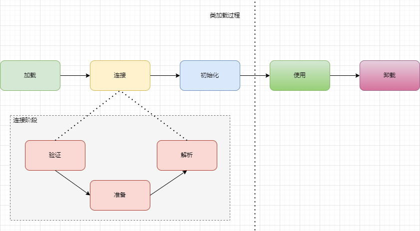
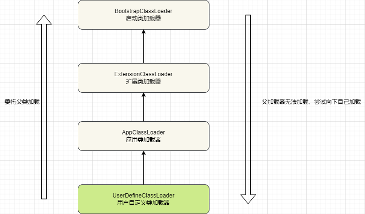

# 类加载

## 类的生命周期



## 类加载过程

Class文件需要加载到虚拟机中才能被使用，JVM虚拟机加载Class类型的文件主要有三步：加载 --> 连接 --> 初始化， 其中连接阶段又分为: 验证 --> 准备 --> 解析

### 加载

加载过程主要完成三件事：

- 通过类的全限定名获取定义此类的二进制字节流文件；
- 将字节流所代表的静态存储结构转换为方法区的运行时数据结构；
- 在内存中生成一个代表该类的Class对象，作为方法区这些数据的访问入口。

虚拟机规范上这三点并不具体，因此是非常灵活的。比如“通过类的全限定名获取定义此类的二进制字节流”并没有指明具体从哪里获取以及怎样获取。比如常见的就是从ZIP、JAR、WAR包中读取，当然也有从其他文件中生成以及通过网络获取。

一个非数组类的加载阶段(加载阶段获取类的二进制字节流的动作)是可控性最强的阶段，这一步我们可以去完成还可以自定义类加载器去控制获取字节流的获取方式(重写一个类加载器的loadClass方法)。
数组类型不能通过类加载器创建，其由Java虚拟机直接创建。

加载阶段和连接阶段的部分内容是交叉进行的，加载阶段尚未结束，连接阶段可能就已经开始了。

### 连接

#### 验证

验证阶段主要是验证虚拟机加载的Class文件是否是符合虚拟机规范的，主要包括：

- 文件格式验证：验证字节流是否符合Class文件格式的规范，例如是否是以0xCAFEBABE开头、主版本号是否在当前的虚拟机的处理范围之内，常量池中的常量是否有不被支持的类型。
- 元数据验证：对字节码描述的信息进行语义分析(注意对比javac编译阶段的语义分析)，以保证其描述的信息符合Java语言规范的要求，例如这个类是否有父类(除java.lang.Object之外的类都有父类)
  、这个类是否被继承了不允许继承的类(final修饰的类)等等。
- 字节码验证：最复杂的阶段，通过数据流和控制流分析，确定程序语义是合法的、符合逻辑的。比如保证任意时刻操作数栈和指令代码序列都能配合工作。
- 符号引用验证：确保解析动作能够正确执行。

#### 准备

准备阶段是正式为类变量分配内存并设置类变量初始值的阶段，这些内存都将在方法区中分配。需要注意的是：

- 这时候进行内存分配的仅包括类变量(即静态变量，被static修饰的变量，只与类相关)，而不包含实例变量，实例变量会在对象实例化的时候随对象分配在Java堆中。
-
从概念上讲，类变量所使用的内存都应当在方法区中进行分配。不过有一点需要注意的是JDK7之前，HotSpot使用永久代来实现方法区，类变量所使用的内存都在方法区中分配，但是JDK8开始，HotSpot已经把原本放在永久代的字符串常量池、静态变量等移动到堆中，这个时候类变量则会随着Class对象一起存放在Java堆中。
- 这里设置的初始值通常情况下数据类型默认的零值，而如果变量被final修饰，那么变量设置的初始值则是定义的值。

变量零值对应表

| 数据类型  | 零值      |
| --------- | --------- |
| int       | 0         |
| long      | 0L        |
| short     | (short) 0 |
| char      | '\u0000'  |
| byte      | (byte) 0  |
| boolean   | false     |
| float     | 0.0f      |
| double    | 0.0d      |
| reference | null      |

#### 解析

解析阶段是虚拟机将常量池内的符号引用替换为直接引用的过程。解析动作主要针对类或接口、字段、类方法、接口方法、方法类型、字段句柄和限定符7类符号引用进行。

符号引用就是一组符号来描述目标，可以是任何字面量。直接引用就是直接指向目标的指针、相对偏移量或一个间接定位到目标的句柄，在程序实际运行时，必须明确知道所引用的对象的明确位置。通过解析符号引用就可以将该符号引用转化为目标的直接引用。

### 初始化

初始化阶段是执行初始化方法`<cinti>`方法的过程，这一步JVM才开始真正执行类中定义的Java程序的字节码。`<cinti>`方法是编译之后自动生成的。

对于`<cinti>`方法的调用，虚拟机会自己确保其在多线程环境中的安全性，因为`<cinti>`方法是线程安全的，所以在多线程环境下进行类初始化的话可能会引起多个进程的阻塞，并且这种阻塞很难被发现。

对于初始化阶段，虚拟机严格规范了有且仅有6种情况必须对类进行初始化(只有主动去使用类才会初始化类)：

1. 当遇到`new`、 `getstatic`、 `putstatic`、 `invokestatic`这4条直接码指令时

- 当JVM执行`new`指令时会初始化类，即当程序创建一个类的实例对象；
- 当JVM执行`getstatic`指令时会初始化类，即此程序访问类的静态变量(不是静态常量，常量会被加载到运行时常量池)；
- 当JVM执行`putstatic`指令时会初始化类，即程序给类的静态变量赋值；
- 当JVM执行`invokestatic`指令时会初始化类，即程序调用类的静态方法。

2. 使用`java.lang.reflect`包的方法对类进行反射调用时，如`Class.forname`, `newInstance()`等等
3. 初始化一个类，如果其父类没有被初始化，则先触发父类的初始化
4. 当JVM启动时，用户需要定义一个要执行的主类(包含`main`方法的那个类)，虚拟机会先初始化这个类。
5. `MethodHandle`和`VarHandle`可以看作时轻量级的反射调用机制，而要想使用这2个调用，就必须先初始化`findStaticVarHandle`来初始化要调用的类。
6. 当一个接口中定义了JDK8新加入的默认方法(被default关键字修饰的接口方法)时，如果有这个接口的实现类发生类初始化，那该接口要在其前就被初始化

### 卸载

卸载类即该类的Class对象被GC，需要满足３个条件：

- 该类的所有实例对象都已被GC，也就是说堆中不存在该类的实例对象。
- 该类没有在其他任何地方被引用
- 该类的类加载器的实例已被GC

所以在JVM生命周期中，由JVM自带的类加载器加载的类是不会被卸载的，但是由我们自定义的类加载器加载的类是可能被卸载的。

## 类加载器ClassLoader

类加载阶段，最重要的就是类加载器，JVM中内置了三个类加载器：

- BootstrapClassLoader: 启动类加载器，最顶层的类加载器，由C++实现，负责加载%JAVA_HOME%/lib下面的jar包和类，或者被 -Xbootclasspath参数指定的路径中的所有类；
- ExtensionClassLoader: 扩展类加载器，主要负责加载%JVAVA_HOME%/lib/ext目录下的jar包和类，或者被java.ext.dirs系统变量所指定的路径下的所有jar包；
- AppClassLoader：应用类加载器，面向我们用户的加载器，负责加载当前classpath下的所有jar包和类。

### 双亲委派机制



系统中的ClassLoader在协同的时候会默认使用双亲委派模型，即在类加载的时候，系统会首先判断当前类是否被加载过，已经加载的类会直接返回，否则才会尝试进行加载。加载的时候，首先会把该请求委派给父类加载器的`loadClass()`
处理，因此所有的请求最终都应该传送到底层的BootstrapClassLoader中。当父类加载器无法处理时，才由自己来处理，当父类加载器为null时，会使用BootstrapClassLoader作为父类加载器。

`AppClassLoader`的父加载器为`ExtensionClassLoader`，`ExtensionClassLoader`的父类加载器为null，null并不是代表`ExtensionClassLoader`
没有父类加载器，而是`BootstrapClassLoader`

```java
    /**
     * Loads the class with the specified <a href="#name">binary name</a>.  The
     * default implementation of this method searches for classes in the
     * following order:
     *
     * <ol>
     *
     *   <li><p> Invoke {@link #findLoadedClass(String)} to check if the class
     *   has already been loaded.  </p></li>
     *
     *   <li><p> Invoke the {@link #loadClass(String) <tt>loadClass</tt>} method
     *   on the parent class loader.  If the parent is <tt>null</tt> the class
     *   loader built-in to the virtual machine is used, instead.  </p></li>
     *
     *   <li><p> Invoke the {@link #findClass(String)} method to find the
     *   class.  </p></li>
     *
     * </ol>
     *
     * <p> If the class was found using the above steps, and the
     * <tt>resolve</tt> flag is true, this method will then invoke the {@link
     * #resolveClass(Class)} method on the resulting <tt>Class</tt> object.
     *
     * <p> Subclasses of <tt>ClassLoader</tt> are encouraged to override {@link
     * #findClass(String)}, rather than this method.  </p>
     *
     * <p> Unless overridden, this method synchronizes on the result of
     * {@link #getClassLoadingLock <tt>getClassLoadingLock</tt>} method
     * during the entire class loading process.
     *
     * @param name    The <a href="#name">binary name</a> of the class
     * @param resolve If <tt>true</tt> then resolve the class
     * @return The resulting <tt>Class</tt> object
     * @throws ClassNotFoundException If the class could not be found
     */
    protected Class<?> loadClass(String name, boolean resolve) throws ClassNotFoundException {
        synchronized (getClassLoadingLock(name)) {
            // 首先检查class是否已经被加载过了
            Class<?> c = findLoadedClass(name);
            if (c == null) {
                long t0 = System.nanoTime();
                try {
                    if (parent != null) {
                        // 父加载器不为null，则委托父类进行加载
                        c = parent.loadClass(name, false);
                    } else {
                        // 父加载器为null，则使用BootstarpClassLoader加载
                        c = findBootstrapClassOrNull(name);
                    }
                } catch (ClassNotFoundException e) {
                    // 说明父类加载器无法加载
                }

                if (c == null) {
                    long t1 = System.nanoTime();
                    // 父加载器无法加载，尝试自己加载
                    c = findClass(name);

                    // this is the defining class loader; record the stats
                    sun.misc.PerfCounter.getParentDelegationTime().addTime(t1 - t0);
                    sun.misc.PerfCounter.getFindClassTime().addElapsedTimeFrom(t1);
                    sun.misc.PerfCounter.getFindClasses().increment();
                }
            }
            if (resolve) {
                resolveClass(c);
            }
            return c;
        }
    }
```

双亲委派机制保证了Java程序的稳定运行，可以避免类的重复加载(JVM区分不同类的方式不仅仅根据类名，相同的类文件被不同的类加载器加载产生的是两个不同的类)
，也保证了Java的核心API不被篡改。如果没有双亲委派机制，而是每个类加载器加载自己的话就会出现问题，比如出现多个java.lang.Object的类

使用自定义的类加载器，需要继承ClassLoader，如果不想打破双亲委派机制，就重写findClass的方法，如果想打破双亲委派机制则需要重写loadClass方法。

### 自定义类加载器的例子

```java

/**
 * 从字节数组加载class
 *
 * @author Young
 * @Date 2021-06-17 23:06
 */
public class MyClassLoader extends ClassLoader {

    @Override
    protected Class<?> findClass(String name) throws ClassNotFoundException {
        byte[] bytes = new byte[100];
        return defineClass(name, bytes, 0, bytes.length);
    }


    public static void main(String[] args) throws ClassNotFoundException, InstantiationException, IllegalAccessException {
        MyClassLoader myClassLoader = new MyClassLoader();
        Class<?> aClass = myClassLoader.loadClass("com.young.classload.ClassTest");
        System.out.println(aClass.getName());
    }
}

```


