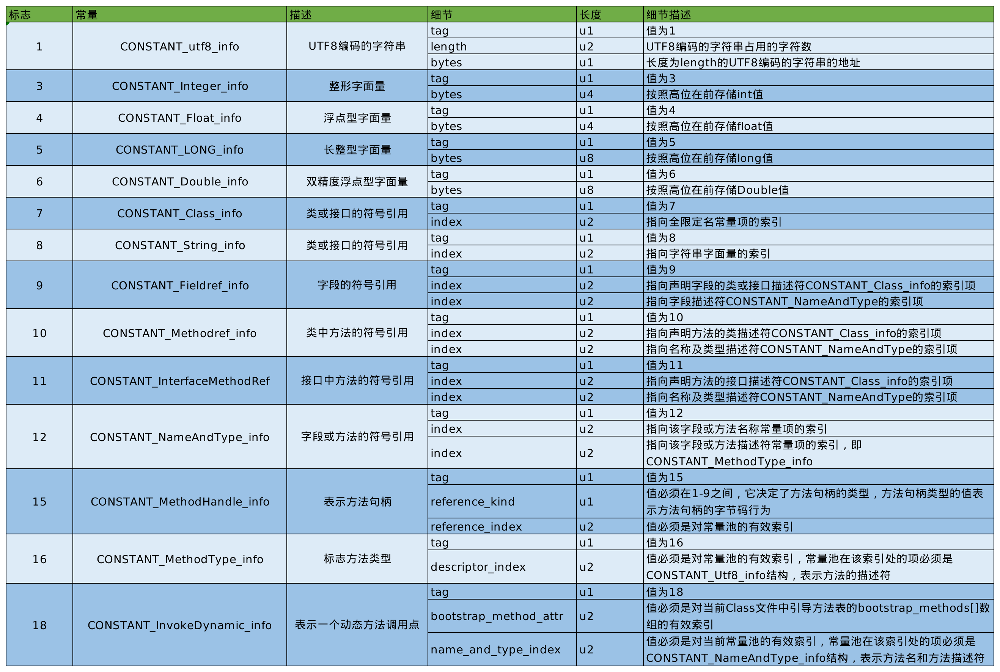

# Java类文件结构

## 字节码文件结构

`.java`格式的Java源代码被编译后输出`.class`
格式的字节码，字节码是JVM能够理解的代码。Java语言通过字节码的方式，在一定程度上解决了传统解释型语言执行效率低的问题，同时又保留了解释型语言可移植的特点。所以Java程序运行时比较高效，而且由于字节码并不针对一种特定的机器，因此，Java程序无需重新编译便可在多种操作系统的计算机上运行。

不用语言写成的源代码只要能够编译成字节码的格式并且满足JVM虚拟机的规范，就可以运行在JVM上，如Groovy、Scala和Ruby等语言。

Class文件是以8字节为基础的字节流构成的，其采用了类似C语言的结构体来存储数据，主要有2类数据项：无符号数和表。无符号数用来表述数字、索引引用以及字符串等，u1、u2、u4分别代表1个、2个4个字节的无符号数。表是有多个无符号数以及其他的表组成的复合结构。

根据虚拟机规范，Class文件通过`ClassFile`定义，有点类似C语言的结构体。

`ClassFile`的结构如下：

```java

ClassFile {
    u4             magic;  // 魔数，Class文件的标志
    u2             minor_version; // Class文件的小版本号
    u2             major_version; // Class文件的大版本号
    u2             constant_pool_count; // 常量池的数量
    cp_info        constant_pool[constant_pool_count-1]; // 常量池
    u2             access_flags; // Class的访问标记
    u2             this_class; // 当前类
    u2             super_class; // 父类
    u2             interfaces_count; // 接口数量
    u2             interfaces[interfaces_count]; // 接口
    u2             fields_count; // 字段数量
    field_info     fields[fields_count]; // 字段
    u2             methods_count; // 方法数量
    method_info    methods[methods_count]; // 方法
    u2             attributes_count; //属性数量
    attribute_info attributes[attributes_count]; // 属性
}

```

### 魔数

```java

    u4             magic;  // 魔数，Class文件的标志
    u2             minor_version; // Class文件的小版本号

```

每个Class文件的前4个字节成为魔数(magic number)，其作用是确定这个文件是否是一个能够被虚拟机接受的Class文件，JVM每次都会先检查魔数的值是否为`0xCAFEBABE`，如果不是此固定值，那么JVM会停止加载。

如果一个Class文件不以0xCAFEBABE开头，虚拟机在进行文件校验的时候就会直接抛出以下错误：

```java
Error: A JNI error has occurred, please check your installation and try again
Exception in thread "main" java.lang.ClassFormatError: Incompatible magic value 1885430635 in class file StringTest

```

### Class文件版本号

```java
    u2             minor_version; // Class文件的小版本号
    u2             major_version; // Class文件的大版本号
```

魔数后面的4个字节存储的Class文件的版本号，其中第五和第六位是小版本号，第七和第八位为主版本号。它们共同构成了class文件的格式版本号。譬如某个 Class 文件的主版本号为 M，副版本号为 m，那么这个Class
文件的格式版本号就确定为 M.m

每当Java发布大版本的时候(Java8、Java9这种)，主版本号就会+1。Java 的版本号是从45开始的，JDK1.1之后的每个JDK大版本发布主版本号向上加1。可以使用`javap -v`命令来快速查看Class文件的版本号信息。

高版本的Java虚拟机可以执行低版本的编译器生成的Class文件，但是低版本的Java虚拟机不能执行高版本编译器生成的Class文件，如果低版本的Java虚拟机执行了高版本的编译器生成的Class文件，会报错`class file has wrong version 50.0, should be 49.0`

在实际应用中，由于开发环境和生产环境的不同，可能会导致该问题的发生。因此，需要我们在开发时，特别注意开发编译的JDK版本和生产环境中的JDK版本是否一致。

### 常量池

```java

    u2             constant_pool_count; // 常量池的数量
    cp_info        constant_pool[constant_pool_count-1]; // 常量池

```

常量池中常量的数量是不固定的，所以在常量池的入口需要放置一项u2类型的无符号数，代表常量池容量计数值（constant_pool_count）。与Java中语言习惯不一样的是，这个容量计数是从1而不是0开始的,
将第0项常量空出来是有特殊考虑的，索引值为0代表不引用任何一个常量池项。

常量池中每一个常量都是一个表，这14种表有一个共同的特点：开始的第一位是一个u1类型的标志位————tag来标识常量的类型，代表当前这个常量是属于哪种类型的常量类型。

|类型|标志(tag)|描述|
|---|---|---|
|CONSTANT_utf8_info|1|UTF8编码的字符串|
|CONSTANT_Integer_info|3|整形字面量|
|CONSTANT_Float_info|4|浮点型字面量|
|CONSTANT_Long_info|5|长整型字面量|
|CONSTANT_Double_info|6|双精度字面量|
|CONSTANT_Class_info|7|类或接口的符号引用|
|CONSTANT_String_info|8|字符串类型的字面量|
|CONSTANT_Fieldref_info|9|字段的符号引用|
|CONSTANT_Methodref_info|10|类中方法的符号应用|
|CONSTANT_InterfaceMethodref_info|11|接口中方法的符号引用|
|CONSTANT_NameAndType_info|12|字段或方法的符号引用|
|CONSTANT_MethodType_info|16|标志方法类型|
|CONSTANT_MethodHandle_info|15|表示方法句柄|
|CONSTANT_InvokeDynamic_info|18|表示一个动态方法调用点|

#### 字面量和符号引用

常量池主要存放的是: 字面量和符号引用。字面量比较接近Java语言层面的常量概念，如文本字符串、声明为final的常量值等。符号引用则属于编译原理方面的概念，包括有三类常量：类和接口的全限定名、字段的名称和描述符、方法的名称和描述符。


##### 全限定名

com/jvm/test/Demo这个就是类的全限定名，仅仅是把包名的“.“替换成”/”，为了使连续的多个全限定名之间不产生混淆，在使用时最后一般会加入一个“;”表示全限定名结束。

##### 简单名称

简单名称是指没有类型和参数修饰的方法或者字段名称，上面例子中的类的add()方法和num字段的简单名称分别是add和num。

##### 描述符

描述符：描述符的作用是用来描述字段的数据类型、方法的参数列表（包括数量、类型以及顺序）和返回值。根据描述符规则，基本数据类型（byte、char、double、float、int、long、short、boolean）以及代表无返回值的void类型都用一个大写字符来表示，而对象类型则用字符L加对象的全限定名来表示，详见下表。描述符在常量池中使用CONSTANCE_Utf8_info表示

|标识符|含义|
|---|---|
|B|基本数据类型byte|
|C|基本数据类型char|
|D|基本数据类型double|
|F|基本数据类型float|
|I|基本数据类型int|
|J|基本数据类型long|
|S|基本数据类型short|
|Z|基本数据类型boolean|
|V|代表void|
|L|代表对象类型，如Ljava/lang/Object;|
|[|代表数组，如`double[]`表示为`[D`|

在描述符来描述方法时，按照先参数列表后返回值的顺序描述，参数列表按照参数的严格顺序放在一组小括号内，如：

- java.lang.String toString() 方法描述符为 ()Ljava/lang/String;
- int abc(int[] x, int y) 方法描述符为([II)I

虚拟机在加载Class文件时才会进行动态链接，也就是说Class文件中不会保存各个方法和字段的最终内存布局信息。因此这些字段和方法的符号引用不经过转换时无法直接被虚拟机使用的。当虚拟机运行时，需要从常量池中获得对应的符号引用，再在类加载过程中的解析阶段将其替换为直接引用，并翻译到具体的内存地址中。

- 符号引用：符号引用以一组符号来描述所引用的目标，符号可以是任何形式的字面量，只要使用时能无歧义地定位到目标即可。符号引用与虚拟机实现的内存布局有关，引用的目标并不一定已经加载到内存中。
- 直接引用：直接引用可以是直接指向目标的指针、相对偏移量或是一个能间接定位到目标的句柄。直接引用是与虚拟机实现内存布局相关的，同一个符号引用在不同虚拟机实例上翻译出来的直接引用一般不会相同。如果有了直接引用，那说明引用的目标必定已经存在于内存之中了。

#### 常量类型和结构



- 这14种表的共同点：表开始的第一位是一个u1类型的标志位, 代表当前这个常量项使用的是哪一种表结构
- 在常量池列表中，CONSTANCE_Utf8_info常量项是一种使用改进过UTF8编码格式来存储诸如文字字符串、类或者接口全限定名、字段或者方法的简单名称以及描述符等常量字符串信息，其大小由length决定。因为从常量池存放的内容可知，其存放的是字面量和符号引用，最终这些内容都会是一个字符串，这些字符串的大小是在编写程序时才能确定，比如你定义一个类，类名可以取长取短，所以在没编译前，大小不确定，编译后通过utf8编码才可以直到其长度


### 访问标志(Access Flag)

```java
    u2             access_flags; // Class的访问标记
```

访问标志用于识别一些类或者接口层次的访问信息，包括：这个Class是类还是接口，是否为public或者abstract类型，类的声明是否为final等等。

|标志名称|标志值|含义|
|---|---|---|
|ACC_PUBLIC|0x0001|标志为public,可以在外部访问|
|ACC_FINAL|0x0010|标志为final，不可以有子类|
|ACC_SUPER|0x0020|标志允许使用invokespecial字节码指令的新语义，JDK1.0.2之后编译出来的类的这个标志默认为true(使用增强的方法调用父类的方法)|
|ACC_INTERFACE|0X0200|标志这是一个接口|
|ACC_ABSTRACT|0x0400|是否为abstract类型，对于接口或者抽象类来说，此标志位为true，其他类型为false|
|ACC_SYNTHETIC|0x1000|标志此类并非由用户代码产生(由编译器产生的类，没有源码对应)|
|ACC_ANNOTATION|0x2000|标志这时一个注解|
|ACC_ENUM|0x4000|枚举类|

类的访问权限通常为ACC_开头的常量

每一种类型的表示都是通过设置访问标记的32的特定位来实现的，比如pubic final的类，则该标记为ACC_PUBLIC|ACC_FINAL.

ACC_SUPER可以让类更准确地定位到父类的方法super.method， 现代编译器都会设置并使用这个标志。

ACC_INTERFACE标志的是接口而不是类，反之则表示的是类而不是接口
- 如果一个class文件被设置了ACC_INTERFACE标志，那么同时也得设置ACC_ABSTRACT标志。同时不能被设置为ACC_FINAL、ACC_SUPER或ACC_ENUM标志。
- 如果没有设置ACC_INTERFACE标志，那么这个class文件可以具有上表中除ACC_ANNOTATION外的其他所有标志。当然，ACC_FINAL和ACC_ABSTRACT这类互斥的标志除外。
  
ACC_SUPEr标志用于确定类或接口里面的invokespecial指令使用的是哪一种执行语义。针对Java虚拟机指令集的编译器都应当设置这个标志。对于JavaSe8及以后的版本来说，无论class文件中这个标志的实际值是什么，也不管class文件的版本号是多少，Java虚拟机都认为每个class文件均设置了ACC_SUPER标志。ACC_SUPER标志是为了向后兼容由旧的Java编译器所编译的代码而设计的。目前的ACC_SUPER标志在由JDK1.0.2之前的编译器所生成的access_flag中没有确定含义，如果设置了该标志，那么Oracle的JVM实现会将其忽略。

ACC_SYNTHETIC标志意味着该类或者接口是有编译器生成的，而不是由源代码生成的。

注解类型必须设置ACC_ANNOTATIOON标志。如果设置了ACC_ANNOTATION标志，那么也必须设置ACC_INTERFACE标志。

ACC_ENUM标志表明该类或其父类为枚举类型

### 类索引、父类索引、接口索引集合

```java
    u2             this_class; // 当前类
    u2             super_class; // 父类
    u2             interfaces_count; // 接口数量
    u2             interfaces[interfaces_count]; // 接口
```

|长度|含义|说明|
|---|---|---|
|u2|this_class|2字节无符号整数，指向常量池的索引，提供了类的全限定名，其值必须是对常量池表中某一项的有效索引值。常量池在这个索引处的项必须是CONSTANT_Class_info|
|u2|super_class|2字节无符号整数，指向常量池的索引，提供了父类的全限定名。如果没有继承任何类，其默认继承的是java/lang/Object类，同时Java不支持多继承，所以其父类只有一个。super_class不能是final的|
|u2|interfaces_count|当前类或接口的直接实现的接口数量|
|u2|interfaces[interfaces_count]|每个成员的值必须是对常量池中某项的有效索引，长度为interfaces_count，每个成员都必须为CONSTANCT_Class_info结构。在interfaces[]中，各成员所表示的接口顺序和对应的源代码中给定的接口顺序（从左至右）一样，即interfaces[0]对应的是源代码中最左边的接口|

### 字段表集合

```java
    u2             fields_count; // 字段数量
    field_info     fields[fields_count]; // 字段
```

字段表用来描述接口或者类中声明的变量。字段(field)包括类级变量以及实例级变量，但是不包括方法内部、代码块内部声明的局部变量。字段叫什么名字、字段被定义为什么数据类型，这些都是在编码阶段才能知道的，所以其只能引用常量池的常量来描述。字段表指向常量池索引集合，描述了每个字段的完整信息。比如字段的标志符、访问修饰符、类变量or实例变量，是否是常量等。

字段表集合中不会出现从父类或者实现的接口中继承而来的字段，但是由可能列出原本Java代码之中不存在的字段。比如在内部类中为了保持对外部类的访问性，会自动添加指向外部类实例的字段。

在Java语言中字段是无法重载的，两个字段的数据类型、修饰符不管是否相同，都必须使用不一样的名字，但是对于字节码来说，如果两个字段的描述符不一致，那字段重名就是合法的。

#### 字段计数器fields_count

fields_count的值表示当前class文件fields表的成员个数，使用两个字节表示。

#### 字段表field_info[]

字段表中每个成员都是一个field_info结构，用于表示该类或接口中所声明的类字段或者实例字段，不包括方法内部声明的变量，也不包括从父类或父接口中继承的字段。

一个字段包括如下信息：
- 作用域(public、private、proteced修饰符等)
- 是实例变量还是类变量(static修饰符)
- 可变性(final)
- 并发可见性(volatile修饰符)
- 是否序列化(transient修饰符)
- 字段数据类型(基本数据类型、对象、数组)
- 字段名称

字段表的结构如下：

```java

field_info {
    u2             access_flags;
    u2             name_index;
    u2             descriptor_index;
    u2             attributes_count;
    attribute_info attributes[attributes_count];
}

```

##### 字段访问标识 access_flags

一个字段可以被各种关键字修饰，比如：作用域(public、private、protected)、static修饰符、final修饰符、volatile修饰符。因此，可以像类一样，使用一些标记来标记字段。字段的访问标记有：

|标志名称|标志值|含义|
|---|---|---|
|ACC_PUBLIC|0x0001|字段是否为public|
|ACC_PRIVATE|0x0002|字段是否为private|
|ACC_PROTECTED|0x0004|字段是否为protected|
|ACC_STATIC|0x0008|字段是否为static|
|ACC_FINAL|0x0010|字段是否为final|
|ACC_VOLATILE|0x0040|字段是否为volalite|
|ACC_TRANSTENT|0x0080|字段是否为transtent|
|ACC_SYNTHETIC|0x1000|字段是否是编译器自动生成的|
|ACC_ENUM|0x4000|字段是否为枚举类型|

##### 字段名索引name_index

根据字段名索引的值，查询常量池中的制定索引项即可，指向的是常量池表中的CONSTANT_Utf8_info

##### 描述符索引descriptor_index

描述符的作用是用来描述字段的数据类型。 详见上节[描述符](#描述符)

##### 属性表数量attributes_count

表示属性表的数量

##### 属性表数组attributes[attributes_count]

一个字段还可能拥有一些属性，用于存储更多的额外信息，比如初始值、一些注释等。属性的具体内容存放在熟悉性表中。
对于常量属性而言，attributes值恒为2，详见[属性表](#属性表)

### 方法表

```java
    u2             methods_count; // 方法数量
    method_info    methods[methods_count]; // 方法
```

在字节码文件中，每一个method_info项都对应着一个类或者接口中的方法信息。比如方法的访问修饰符(public、private、protected)，方法的返回值类型以及方法的参数信息等。方法表只描述当前类或接口中声明的方法，不包括从父类或父接口中继承的方法。方法表中可能会出现编译器自动添加的方法，如类初始化方法<clinit>和实例初始化方法<init>, 方法表中不会体现native方法和抽象方法。

在Java中，如果要重载(overload)一个方法，除了要与原方法具有相同的简单名称之外，还要求必须拥有一个与原方法不同的特征签名，特征签名就是一个方法中各个参数在常量池中的字段符号引用集合，也就是因为返回值不会包含在特征签名中，因此Java语言里无法仅仅依靠返回值的不同来对一个已有方法进行重载。但是在Class文件合适中，特征签名的范围更大一些，只要描述符不是完全一致的两个方法就可以共存，也就是说，如果两个方法由相同的名称和特征签名，但是返回值不同，那么也是可以合法共存于同一个class文件中的。也就是说，尽管Java语法规范并不允许在一个类或者接口中声明多个方法签名相同的方法，但是在字节码文件中却允许存放多个方法签名相同的方法，唯一的条件就是这些方法之间的返回值不能相同。

method_count的值表示当前class文件methods表的成员个数，使用2个字节表示。method表中每个成员都是method_info结构，用于表示当前类或接口中某个方法的完成描述。如果某个method_info结构的access_flags项非ACC_NATIVE和ACC_ABSTRACT，那么该结构中页应该包含实现这个方法所用的Java虚拟机指令。method_info可以表示类或者接口中定义的所有方法，包括实例方法、类方法、实例初始化方法和类或接口的初始化方法，其结构如下：

```java 
method_info {
    u2             access_flags;
    u2             name_index;
    u2             descriptor_index;
    u2             attributes_count;
    attribute_info attributes[attributes_count];
}
```
method_info和field_info结构类似，这里不再赘述，只说明下method_info中的方法访问标志

#### 方法访问标志access_flags

|标志名|标志值|解释|
|---|---|---|
|ACC_PUBLIC|0x0001|public修饰的方法|
|ACC_PRIVATE|0x0002|private修饰的方法|
|ACC_PROTECTED|0x0004|protected修饰的方法|
|ACC_STATIC|0x0008|static修饰的方法|
|ACC_FINAL|0x0010|final修饰的方法，子类不可以重写|
|ACC_SYNCHRONIZED|0x0020|synchronized修饰的方法|
|ACC_BRIDGE|0x0040|bridge方法，编译器自动生成的|
|ACC_VARARGS|0x0080|可变的参数的方法|
|ACC_NATIVE|0x0100|native方法|
|ACC_ABSTARCT|0x0400|abstact方法|
|ACC_STRICT|0x0800|声明为srtictfp，方法中浮点类型的变量都采用严格的浮点计算|
|ACC_SYNTHETIC|0x1000|编译器自动生成的方法|


### 属性表

```java
    u2             attributes_count; //属性数量
    attribute_info attributes[attributes_count]; // 属性
```

属性表中指的是class文件所附带的辅助信息，比如该class文件的源文件名字，以及任何带有RetentionPolicy.CLASS或者RetentionPolicy.RUNTIME的注解。此外字段表、方法表都可以有自己的属性表，用于描述某些场景专有的信息。属性表集合的限制没有那么严格，不再要求各个属性表具有严格的顺序，并且只要不与已有的属性名重复，任何人实现的编译器都可以向属性表中写入自己的属性信息，但是JVM通常会忽略掉不认识的属性。

attributes_count表示的是当前class文件的属性表的个数，属性表中每个成员都是attribute_info结构。

```java
attribute_info {
    u2 attribute_name_index; // 属性名索引
    u4 attribute_length;  // 属性长度
    u1 info[attribute_length];  // 属性表
}
```

|Attribute|
|---|
|ConstantValue|
|Code|
|StackMapTable|
|Exceptions|
|InnerClasses|
|EnclosingMethod|
|Synthetic|
|Signature|
|SourceFile|
|SourceDebugExtension|
|LineNumberTable|
|LocalVariableTable|
|LocalVariableTypeTable|
|Deprecated|
|RuntimeVisibleAnnotations|
|RuntimeInvisibleAnnotations|
|RuntimeVisibleParameterAnnotations|
|RuntimeInvisibleParameterAnnotations|
|RuntimeVisibleTypeAnnotations|
|RuntimeInvisibleTypeAnnotations|
|AnnotationDefault|
|BootstrapMethods|
|MethodParameters|

#### Code Attribute

```java
Code_attribute {
    u2 attribute_name_index; // 属性名索引
    u4 attribute_length;  // 属性长度
    u2 max_stack;  // 操作数栈最大深度
    u2 max_locals; // 局部变量表所需的存续空间
    u4 code_length; // 字节码指令长度
    u1 code[code_length]; // 存储字节码指令的数组
    u2 exception_table_length; // 异常表长度
    {   u2 start_pc;
        u2 end_pc;
        u2 handler_pc;
        u2 catch_type;
    } exception_table[exception_table_length]; // 异常表
    u2 attributes_count; // 属性集合计数器
    attribute_info attributes[attributes_count]; // 属性集合
}
```

## 字节码查看工具

### jclasslib

[jclasslib](https://github.com/ingokegel/jclasslib)

### javap

javap 是 JDK 自带的反解析工具。它的作用就是根据 Class 字节码文件，反解析出当前类对应的 Code 区(字节码指令)、局部变量表、异常表和代码行偏移量映射表、常量池等信息


```shell
aba@xxl:~$ javap --help
用法: javap <options> <classes>
其中, 可能的选项包括:
  -help  --help  -?        输出此用法消息
  -version                 版本信息
  -v  -verbose             输出附加信息
  -l                       输出行号和本地变量表
  -public                  仅显示公共类和成员
  -protected               显示受保护的/公共类和成员
  -package                 显示程序包/受保护的/公共类
                           和成员 (默认)
  -p  -private             显示所有类和成员
  -c                       对代码进行反汇编
  -s                       输出内部类型签名
  -sysinfo                 显示正在处理的类的
                           系统信息 (路径, 大小, 日期, MD5 散列)
  -constants               显示最终常量
  -classpath <path>        指定查找用户类文件的位置
  -cp <path>               指定查找用户类文件的位置
  -bootclasspath <path>    覆盖引导类文件的位置
```

### javac -g

解析字节码文件得到的信息中，有些信息(如局部变量表、指令和代码行偏移量映射表、常量池中方法的参数名称等等)需要在使用 javac 编译成 Class 文件时，指定参数才能输出,比如，你直接 javac xx.java，就不会在生成对应的局部变量表等信息，如果你使用 javac -g xx.java 就可以生成所有相关信息了。如果你使用的 Eclipse 或 IDEA，则默认情况下，Eclipse、IDEA 在编译时会帮你生成局部变量表、指令和代码行偏移量映射表

## 参考

- [JVM_18_虚拟机的基石:Class文件](https://blog.csdn.net/ZSA222/article/details/122992183)
- [Java SE8](https://docs.oracle.com/javase/specs/jvms/se8/html/index.html)
- [类文件结构详解](https://javaguide.cn/java/jvm/class-file-structure.html#%E4%B8%80-%E6%A6%82%E8%BF%B0)


