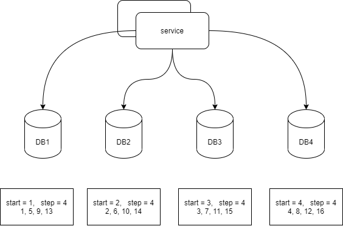
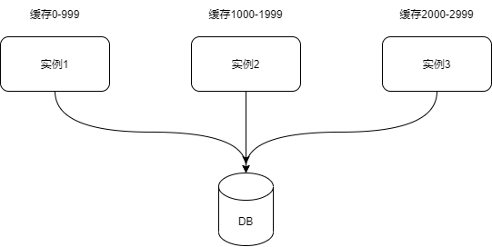

- [分布式唯一ID](#分布式唯一id)
  - [1. 背景](#1-背景)
  - [2. 概念](#2-概念)
    - [2.1  什么是分布式唯一ID](#21--什么是分布式唯一id)
    - [2.2 分布式唯一ID的特性](#22-分布式唯一id的特性)
    - [2.3 单调递增和趋势递增](#23-单调递增和趋势递增)
    - [2.4 设计分布式ID系统需注意的点](#24-设计分布式id系统需注意的点)
    - [2.5 分布式ID系统的难点](#25-分布式id系统的难点)
  - [3. 分布式ID生成方案](#3-分布式id生成方案)
    - [3.1 UUID](#31-uuid)
      - [3.1.1 UUID概念](#311-uuid概念)
      - [3.1.2 UUID优缺点](#312-uuid优缺点)
      - [3.1.3 Java生成UUID](#313-java生成uuid)
    - [3.2 数据库自增](#32-数据库自增)
      - [3.2.1 概念](#321-概念)
      - [3.2.2 优缺点](#322-优缺点)
      - [3.2.3 MySQL设置自增的方式](#323-mysql设置自增的方式)
    - [3.3 数据库集群模式](#33-数据库集群模式)
      - [3.3.1 原理](#331-原理)
      - [3.3.2 优缺点](#332-优缺点)
      - [3.3.3 MySQL设置起始值和步长的方法](#333-mysql设置起始值和步长的方法)
    - [3.4 数据库号段模式](#34-数据库号段模式)
      - [3.4.1 原理](#341-原理)
      - [3.4.2 优缺点](#342-优缺点)
      - [3.4.3 实现](#343-实现)
        - [3.4.3.1 乐观锁实现](#3431-乐观锁实现)
        - [3.4.3.2 悲观锁实现](#3432-悲观锁实现)
    - [3.5 Redis/Zookeeper](#35-rediszookeeper)
      - [3.5.1 Redis方式原理](#351-redis方式原理)
        - [3.5.1.1 强依赖redis方案](#3511-强依赖redis方案)
        - [3.5.1.2 弱依赖redis方案](#3512-弱依赖redis方案)
      - [3.5.2 优缺点](#352-优缺点)
      - [3.5.3 实现(redis自增模式的实现)](#353-实现redis自增模式的实现)
    - [3.6 雪花算法](#36-雪花算法)
    - [3.7 美团Leaf算法](#37-美团leaf算法)
    - [3.8 百度uid-generator](#38-百度uid-generator)
    - [3.9 滴滴TinyId](#39-滴滴tinyid)
  - [4 参考资料](#4-参考资料)
# 分布式唯一ID
## 1. 背景

我们在设计和实现互联网系统时，往往需要使用到唯一ID。唯一ID标识唯一的一条业务请求，如在电商系统中，ID表示系统中唯一的一个订单，支付系统中表示唯一的一条交易请求。在单机应用中，唯一ID的生成是比较简单的，我们只需保证ID在单机上面是唯一的即可；但目前互联网应用多为微服务应用，同时随着业务的逐渐增长，必须对业务进行分库分表，而且业务应用往往是多实例部署的，这就要求ID在多个微服务应用和多个应用实例之间是唯一。目前业界有很多成熟的唯一ID生成方案，下面我们来看下这些分布式唯一的ID生成方案。

## 2. 概念

### 2.1  什么是分布式唯一ID

我的理解是；分库分表应用中多实例、各微服务应用之间全局唯一的ID即是分布式式唯一ID。

### 2.2 分布式唯一ID的特性

- 全局唯一：唯一ID，顾名思义；
- 高性能：ID生成的性能要高，否则会影响业务系统的性能；
- 高可用：ID生成服务要是高可用的，否则一旦出现不可用则会影响业务系统的可用性；
- 递增；尽量保证是递增的，因为业务系统可能需要根据ID进行排序，分为单调递增和趋势递增；
- 长度：长度尽可能的短；
- 侵入性小：尽量做到对业务系统无侵入。

此外，根据业务的不同，还可能要存在其他特性：

- 时间：有的ID中需要包含时间戳；
- 业务含义：这个要看具体的业务需求。

### 2.3 单调递增和趋势递增

- 单调递增：ID是严格递增的，后面的请求ID一定比之前的请求的ID大；
- 趋势递增：ID的整体趋势是递增的，不过存在后面的请求的ID比之前的请求ID小的情况。比如这样的ID生成方案：考虑这样的一个场景，2个实例的业务应用，实例1缓存0-1000的ID在进程中，实例2缓存1001-2000的ID在进程中，请求1先请求实例2（随机负载均衡），ID为1001，然后1分钟后请求2请求实例1，ID为0，即出现后面的请求的ID比之前的请求的ID小的情况，但是ID分配的整体趋势是递增的。

### 2.4 设计分布式ID系统需注意的点

- 时钟回退：如果ID中包含时间戳信息，需考虑时钟回退的场景，如果出现时钟回退则可能出现重复ID；
- 多线程问题：ID生成往往是在多线程的环境下的，因此需要注意多线程问题；
- 数据库性能：有些ID生成算法依赖数据库中的记录，需要考虑数据库的性能问题以及多线程引发的数据库锁问题

### 2.5 分布式ID系统的难点
- ID长度尽可能的短：我们的ID大多数是需要在数据库中存储的，越长的ID占用的空间越多；如果使用该ID作为MySQL的主键，主键也是要求尽可能的短的，所以ID长度要尽可能的短。随之而来的问题是，越短的ID，其中包含的信息越少（信息熵越小），冲突的可能性就越大；
- 多线程问题：多实例之间，同一实例之间的线程都会抢ID，因此必须注意多线程问题，解决方法大部分是加锁，如果线程之间竞争严重，则严重形象性能。


## 3. 分布式ID生成方案

### 3.1 UUID

#### 3.1.1 UUID概念

UUID(universally unique identifier)是一串随机的32位长度的数据，每一位是16进制表示，所以总计能够表示2^128的数字

据统计若每纳秒产生1百万个 UUID，要花100亿年才会将所有 UUID 用完

UUID的生成用到了以太网卡地址、纳秒级时间、芯片ID码和许多可能的数字

UUID为16进制的32字节长度，中间以`-`相连，形式为8-4-4-4-12，所以说长度也可以是36，不过使用时一般不包含`-`，UUID的形式如下：
```java
ef56e7fd-225b-44b8-b96d-4591bde0945b
********-****-M***-N***-************
```

> 上面的以数字`M`开头的四位表示UUID 版本，目前UUID的规范有5个版本，M可选值为1, 2, 3, 4, 5 ;各个版本的具体介绍如下所示：

> - version 1：0001。基于时间和 MAC 地址。由于使用了 MAC 地址，因此能够确保唯一性，但是同时也暴露了 MAC 地址，私密性不够好。
> - version 2：0010。DCE 安全的 UUID。该版本在规范中并没有仔细说明，因此并没有具体的实现。
> - version 3：0011。基于名字空间 (MD5)。用户指定一个名字空间和一个字符串，通过 MD5 散列，生成 UUID。字符串本身需要是唯一的。
> - version 4：0100。基于随机数。虽然是基于随机数，但是重复的可能性可以忽略不计，因此该版本也是被经常使用的版本。
> - version 5：0101。基于名字空间 (SHA1)。跟 Version 3 类似，但是散列函数编程了 SHA1。

> 上面以数字`N`开头的四个位表示 UUID 变体( variant )，变体是为了能兼容过去的 UUID，以及应对未来的变化，目前已知的变体有如下几种，因为目前正在使用的 UUID 都是 variant1，所以取值只能是 8，9，a，b 中的一个(分别对应1000,1001,1010,1011)。

> - variant 0：0xxx。为了向后兼容预留。
> - variant 1：10xx。当前正在使用的。
> - variant 2：11xx。为早期微软 GUID 预留。
> - variant 3：111x。为将来扩展预留。目前暂未使用。

#### 3.1.2 UUID优缺点

**优点**

- 无需网络，单机即可生成
- 速度快
- 生成简单，有内置的函数库可直接实现
- 没有业务含义，随机性较好，保密性强(业务层保密，有些版本的UUID可泄露IP或者MAC地址)
- 机器生成，可保证唯一，讲道理不会重复，但是也存在重复的概率(很低)

**缺点**

- 没有业务含义，如果ID中需要业务含义则不适用UUID
- 太长了，32位长度
- 无序，可读性差
- 有些版本的UUID可泄露IP或者MAC地址

#### 3.1.3 Java生成UUID

Java内置了`java.util.UUID`类，其中内置了四种版本的UUID生成策略,包括基于时间和MAC地址的、DCE 安全的UUID、基于名字空间(MD5)和基于随机数的: 

> There are four different basic types of UUIDs: time-based, DCE
> security, name-based, and randomly generated UUIDs.  These types have a
> version value of 1, 2, 3 and 4, respectively.

比较常用的即是基于随机数的UUID生成，下面是Java的使用方法

```java
    UUID.randomUUID().toString();
```

### 3.2 数据库自增

#### 3.2.1 概念

使用数据库的id自增策略,比如Mysql的auto_increment

#### 3.2.2 优缺点

**优点**

- ID单调递增，对业务友好，利于分页和排序；
- 简单，代码中无需设置，只需要在建表时设置主机递增即可；

**缺点**

- 强依赖数据库, 性能存在瓶颈
- 单库时使用方便,分库分表后就难受了
- 难以扩展
- 只能主库生成,单点故障了就gg了
- 数据库语法不同,迁移时需要考虑
- 容易泄密,比如订单号是递增的,那么可以猜到别人的订单号

#### 3.2.3 MySQL设置自增的方式

只需设置主键自增即可,如下面的建表语句

```SQL
CREATE TABLE `user` (
  `id` bigint unsigned NOT NULL AUTO_INCREMENT COMMENT 'id',
  `name` varchar(64) NOT NULL COMMENT '名字',
  `nick_name` varchar(64) CHARACTER SET utf8mb4 COLLATE utf8mb4_0900_ai_ci NOT NULL COMMENT '昵称',
  `create_time` datetime NOT NULL COMMENT '创建时间',
  `update_time` timestamp NOT NULL DEFAULT CURRENT_TIMESTAMP ON UPDATE CURRENT_TIMESTAMP COMMENT '更新时间',
  PRIMARY KEY (`id`)
) ENGINE=InnoDB DEFAULT CHARSET=utf8 COLLATE=utf8_general_ci;
```

### 3.3 数据库集群模式

#### 3.3.1 原理

数据库自增模式生成的唯一ID,当遇到分库分表场景时, ID则无法解决ID重复的问题，而且ID依赖于数据库，无法满足业务系统高并发以及高可用的需求．一种解决方案是使用数据库多主模式,也即数据库集群中每个实例都可以生成ID, 并且设置自增ID的起始值和步长

其原理图如下：



#### 3.3.2 优缺点

**优点**

- 解决数据库自增模式下的单点故障问题以及性能问题
- 设置同样简单,只比数据库自增模式复杂一些
- ID趋势自增，在同一数据库中是严格递增的

**缺点**

- 不利于后续扩容: 当我们在开始时设置步长为4时,这样每台数据库实例生成的ID如上图所示(图中下面方框中),但是随着业务增长,如果需要水平扩展数据库,即再增加一个数据库实例,这种情况下需将第5台实例的步长设置为5,第5台实例的起始位置要大于前4台实例中ID的最大值(预留部分,防止此段时间前4个实例中ID超过该值), 并且将前4台实例的步长修改为5. 而且还存在停机修改的可能性; 一种解决方案是初始时预留足够的步长,比如初始时有4台实例,但是设置步长可以为8,后续可水平扩展(当然缺点是单个实例ID耗尽速度*2)
- 强依赖数据库，同样存在性能问题. 如果是水平切分，如根据用户ID分库分表，那么某个分库挂了同样会影响可用性


#### 3.3.3 MySQL设置起始值和步长的方法

```SQL
实例1:

set @@auto_increment_offset = 1;     -- 起始值
set @@auto_increment_increment = 6;  -- 步长

实例2:

set @@auto_increment_offset = 2;     -- 起始值
set @@auto_increment_increment = 6;  -- 步长

实例3:

set @@auto_increment_offset = 3;     -- 起始值
set @@auto_increment_increment = 6;  -- 步长

实例4:

set @@auto_increment_offset = 4;     -- 起始值
set @@auto_increment_increment = 6;  -- 步长
```

### 3.4 数据库号段模式

#### 3.4.1 原理

数据和本地缓存相结合的方式, 每个实例首先从数据库中取出一个ID的生成范围，然后需要使用时采用线程安全的方式从本地缓存的ID范围中取出即可,等实例内缓存的ID耗尽时再从数据库中取出一个ID生成范围



#### 3.4.2 优缺点

**优点**

- 弱依赖数据库,每次从数据库中取出一个ID范围,提高了可用性和ID生成的性能. 即使生成ID的数据库挂了,实例中缓存的ID也能撑一段,而这段时间已经足够数据库恢复了(ID数据库和业务数据库是同一个数据库的话,就没用了)
- ID趋势递增

**缺点**

- 实例挂了, 则缓存的号段就丢失了
- 应用自身需保证线程安全, 可以采用AtomicLong的方式来保证

#### 3.4.3 实现

号段模式可以有悲观锁和乐观锁两种实现,  这里我觉得两种方式都可以, 因为该唯一ID的生成方式就说明不会频繁的读写数据库,所以数据库的锁竞争不会很大, 乐观锁和悲观锁方式都可以应该都可以满足需求, 不过使用时还是需要按照具体的业务来设计.

##### 3.4.3.1 乐观锁实现

```SQL

CREATE TABLE id_generator (
  id int(10) NOT NULL,
  max_id bigint(20) NOT NULL COMMENT '当前最大id',
  step int(20) NOT NULL COMMENT '号段的步长',
  biz_type	int(20) NOT NULL COMMENT '业务类型',
  version int(20) NOT NULL COMMENT '版本号',
  PRIMARY KEY (`id`)
) 

```
实例取ID的步骤:

1. 从数据库中获取当前最大ID, SQL为: select max_id, step, version from id_generator where biz_type = '**********';
2. 实例中设置ID范围范围为[max_id, max_id + step]
3. 更新数据库中记录, SQL为: update table id_generator set max_id = max_id + step +1, version = version + 1  where biz_type = '**********' and version = version(第一步中取出的);
4. 如果第三步更新失败, 则说明发生冲突, 从第一步开始重试, 直到第三步成功;

##### 3.4.3.2 悲观锁实现

```SQL

CREATE TABLE id_generator (
  id int(10) NOT NULL,
  max_id bigint(20) NOT NULL COMMENT '当前最大id',
  step int(20) NOT NULL COMMENT '号段的步长',
  biz_type	int(20) NOT NULL COMMENT '业务类型',
  version int(20) NOT NULL COMMENT '版本号',
  PRIMARY KEY (`id`)
) 

```

实例取ID的步骤:

1. 开启事务;
2. 从数据库中获取当前最大ID, SQL为: select max_id, step from id_generator where biz_type = '**********' for update;
3. 实例中设置ID范围范围为[max_id, max_id + step]
4. 更新数据库中记录, SQL为: update table id_generator set max_id = max_id + step +1, version = version + 1  where biz_type = '**********';
5. 提交事务


### 3.5 Redis/Zookeeper

采用中间件的方式, Redis和Zookeeper都可以实现, 不过Zookeeper我很少使用,这里不再讨论,其原理和Redis方式基本相同

#### 3.5.1 Redis方式原理

##### 3.5.1.1 强依赖redis方案

利用redis的 incr命令实现ID的原子性自增。

```

127.0.0.1:6379> set seq_id 1     // 初始化自增ID为1
OK
127.0.0.1:6379> incr seq_id      // 增加1，并返回递增后的数值
(integer) 2
```

##### 3.5.1.2 弱依赖redis方案

原理和数据库号段模式类似, redis中自增的是号段的起始值, 实例内缓存一个ID范围, 这里不再赘述.

#### 3.5.2 优缺点

**优点**

- 实现简单
- 性能比数据库自增ID的方式要高

**缺点**

- 依赖redis, 系统需要引入中间件,增加了运维等成本;
- redis需考虑持久化, redis有两种持久化方式RDB和AOF. RDB会定时打一个快照进行持久化，假如连续自增但redis没及时持久化，而这会Redis挂掉了，重启Redis后会出现ID重复的情况; AOF会对每条写命令进行持久化，即使Redis挂掉了也不会出现ID重复的情况，但由于incr命令的特殊性，会导致Redis重启恢复的数据时间过长。

#### 3.5.3 实现(redis自增模式的实现)

先设置RedisTemplate：

```Java

    @Bean
	public RedisTemplate<String, Serializable> getDefaultRedisTemplate(RedisConnectionFactory cf, RedisSerializer<?> rs) {
		RedisTemplate<String, Serializable> redisTemplate = new RedisTemplate<String, Serializable>();
		redisTemplate.setConnectionFactory(cf);
		redisTemplate.setDefaultSerializer(rs);
		redisTemplate.setKeySerializer(new StringRedisSerializer());
		return redisTemplate;
	}

```
接下来实现ID生成逻辑：

```java

    public long generate(String key,int increment) {
		RedisAtomicLong counter = new RedisAtomicLong(key, mRedisTemp.getConnectionFactory());
		return counter.addAndGet(increment);
	}

```

### 3.6 雪花算法


### 3.7 美团Leaf算法

### 3.8 百度uid-generator

### 3.9 滴滴TinyId

## 4 参考资料

- [分布式ID之UUID适合做分布式ID吗](https://www.itqiankun.com/article/1565060584)
- [UUID/GUID介绍、生成规则及生成代码](https://blog.csdn.net/lizongti/article/details/109000359)
- [分布式唯一 ID 生成方案，有点全！](https://blog.csdn.net/weixin_45727359/article/details/116573914)
- [分布式唯一ID生成方案](https://zhuanlan.zhihu.com/p/88410901)
- [一口气说出9种分布式ID生成方式，面试官有点懵了](https://zhuanlan.zhihu.com/p/107939861)