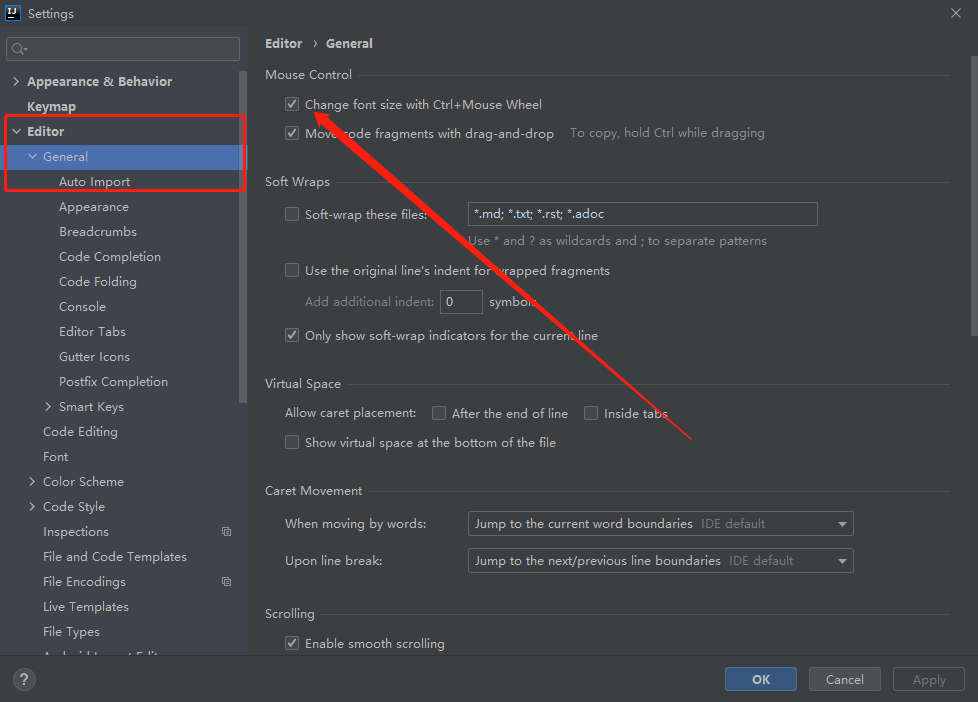
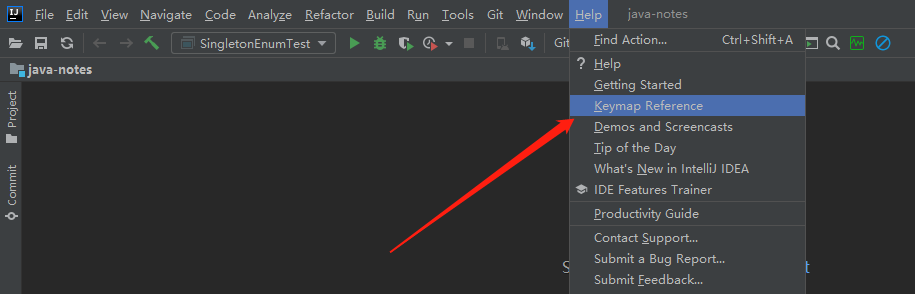
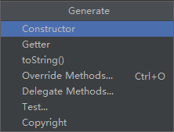
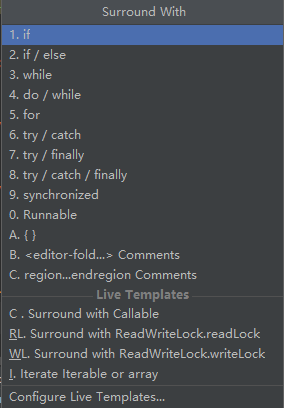
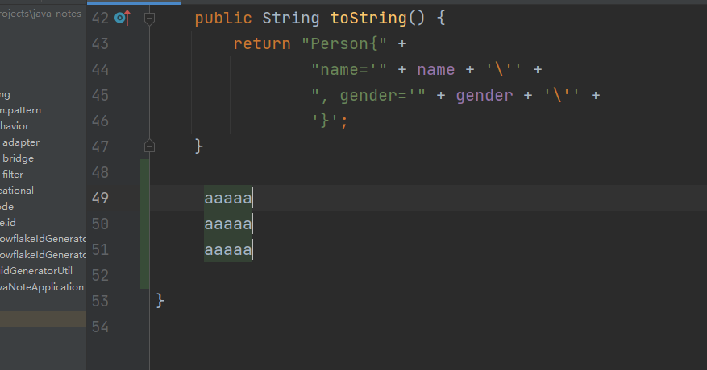
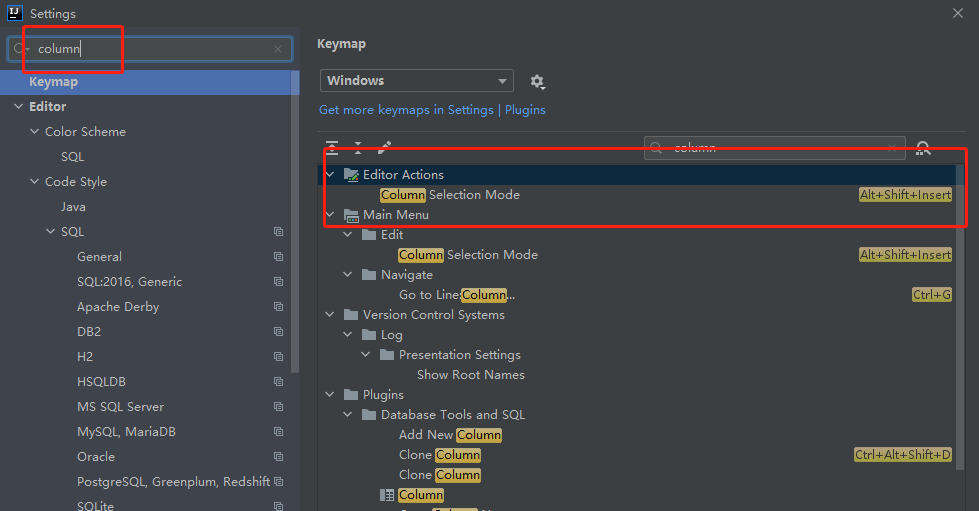

- [IDEA常用操作](#idea常用操作)
  - [1. 设置类](#1-设置类)
    - [1.1 设置Ctrl+滚轮 放大/缩小 编辑窗口](#11-设置ctrl滚轮-放大缩小-编辑窗口)
  - [2. 快捷键](#2-快捷键)
    - [2.1 编辑](#21-编辑)
    - [2.2 导航](#22-导航)
    - [2.3 搜索](#23-搜索)
    - [2.4 重构](#24-重构)
    - [2.5 Debug](#25-debug)
    - [2.6 Git](#26-git)
    - [2.7 通用](#27-通用)
  - [3. 骚操作](#3-骚操作)
    - [3.1 列模式](#31-列模式)
  - [4. Debug操作](#4-debug操作)

# IDEA常用操作

## 1. 设置类

### 1.1 设置Ctrl+滚轮 放大/缩小 编辑窗口

## 2. 快捷键

**如何查看自己的KeyMap?**

下文整理的是**windows/linux**的格式的快捷键

### 2.1 编辑

- Ctrl + P : 查看方法参数

- Ctrl + Q  :  查看方法的JavaDoc

- Alt  + Insert  :  插入代码

- Ctrl + O :  插入重写方法

- Ctrl + I :  实现方法

- Ctrl + Alt + T :  Surround With: 包括代码块

- Crl + / :  单行注释 or 取消单行注释

- Ctrl + Shift + / :  多行注释 or 取消多行注释

- Ctrl + Alt + L :  格式化代码

- Ctrl + Alt + O :  自动去除多余的import

- Ctrl + Alt + I :  自动缩进

- Tab :  向后缩进1个制表符

- Shift + Tab :  向前缩进1个制表符

- Ctrl + X :  剪切当前行

- Ctrl + C :  复制当前行

- Ctrl + V :  粘贴

- Ctrl + Shift + V :  复制的内容的历史记录

- Ctrl + D :  复制当前行到下一行

- Ctrl + Y :  删除当前行

- Ctrl + Shift + [ :  选择当前位置到上一个{的代码

- Ctrl + Shift + ] :  选择当前位置到下一个}的代码

- Ctrl + Shift + U :  大小写转换

- Ctrl + Delete :  删除当前光标后的一个单词、空格等

- Ctrl + Backspace :  删除当前光标前的一个单词、空格等

- Ctrl + '+' :  展开当前光标所在代码块

- Ctrl + '-' :  关闭当前光标所在代码块

- Ctrl + Shift + '+' :   展开所有代码块

- Ctrl + Shift + '-'  :  关闭所有代码块

- Ctrl + F4 :  关闭所有编辑的文件

### 2.2 导航

- Esc :  从tool windows回到编辑区

- Ctrl + E :  弹窗显示最近打开的文件

- Ctrl + Alt + <--- or --->  :   后退 or 前进  光标最近移动位置

- Ctrl + Alt + B  :   进入接口的实现方法中 

- Ctrl + B  or Ctrl + 左键   :    进入方法中，如果是接口则跳到接口上面

- Ctrl + U  :  跳到父类或者父类的方法

- Ctrl + [  or   ]   :    代码块前后

- Ctrl + F12 :  显示类的结构

### 2.3 搜索

- shift + shift   :   任意搜索

- Ctrl + F  :   在当前文件中搜索

- Ctrl + R  :   替换

- Alt + F7 :  查看当前方法/类/变量在何处使用了

### 2.4 重构

- Shift + F6  :  重命名类、方法、变量、常量

- Ctrl + F6 :  调整方法参数

- Ctrl + Alt + M  :  将选中的代码块提取为一个方法

- Ctrl + Alt + C :  将选中的代码提取为一个常量

- Ctrl + Alt + F  :  将选中的代码提取为一个全局变量

- Ctrl + Alt + V  :  将选中的代码提取为一个局部变量

- Ctrl + Alt + P  :  将选中的代码提取为方法的参数

### 2.5 Debug

- F7  :   进入方法

- F8 :    单步调试

### 2.6 Git

- Ctrl + T :  提交界面

- Ctrl + K :  pull

- Ctrl + Shift + K :  push

### 2.7 通用

- Ctrl + Tab  :  切换IDEA中的窗口

## 3. 骚操作

### 3.1 列模式

当我们需要同时操作多行，比如多行的末尾需要加一个';'，比较优雅的操作即是使用列模式，效果图如下：

其中快捷键`Ctrl + ->` 或者 `Ctrl + <-` 可以使光标移动整个单词，再配合Shift使用，即可选中一个单词

进入列模式，直接Alt + 鼠标右键选中即可

进入列模式的快捷键可以这么查看,同样的快捷键，再操作一次即可推出列模式

## 4. Debug操作

