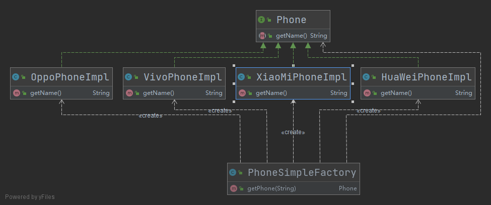
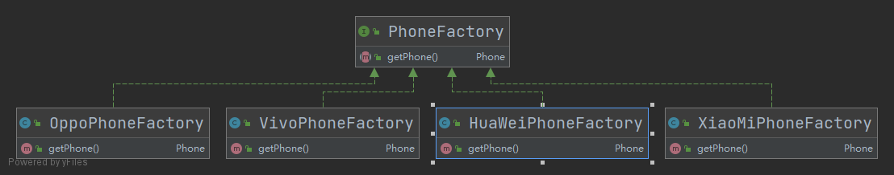

- [工厂模式](#工厂模式)
  - [1. 简单工厂](#1-简单工厂)
    - [1.1 简单工厂实现](#11-简单工厂实现)
    - [1.2 简单工厂的优缺点](#12-简单工厂的优缺点)
  - [2. 工厂方法](#2-工厂方法)
# 工厂模式

工厂模式提供了一种简单、快速、高效且安全地创建对象的方式， 工厂方法不直接创建对象，而将创建对象的过程放到对应的工厂类中实现， 如果后续需要修改对象， 只需更改工厂即可。

工厂模式可以分为三种：

- 简单工厂
- 工厂方法
- 抽象工厂

## 1. 简单工厂

### 1.1 简单工厂实现

在此以手机为例说明工厂方法，手机的品牌有华为、 小米、 VIVO、 OPPO等。 

我们的需求是：根据客户传入的手机品牌名字来实例化一个手机对象。

如果是常规的写法， 我们需要根据传入的手机品牌名字来进行判断(if - else)，这样的就会导致代码中存在大量的if-else分支， 这样很不利于维护。 简单工厂的设计思想即是将实例化对象的过程放到工厂类中， 当我们需要对象时直接调用工厂类即可获取对象。

看下UML类图



```java

1. 手机接口

/**
 * 手机接口
 *
 * @author Young
 * @Date 2021-03-27 22:13
 */
public interface Phone {
    /**
     * 返回手机名
     *
     * @return
     */
    String getName();
}

2. 各个手机对象， 包含华为、 小米、 VIVO、 OPPO

/**
 * 华为手机
 *
 * @author Young
 * @Date 2021-03-27 22:13
 */
public class HuaWeiPhoneImpl implements Phone {
    @Override
    public String getName() {
        return "我是华为手机";
    }
}

/**
 * 小米手机
 *
 * @author Young
 * @Date 2021-03-27 22:09
 */
public class XiaoMiPhoneImpl implements Phone {
    @Override
    public String getName() {
        return "我是小米手机";
    }
}

/**
 * Vivo手机
 *
 * @author Young
 * @Date 2021-03-27 22:11
 */
public class VivoPhoneImpl implements Phone {
    @Override
    public String getName() {
        return "我是VIVO手机";
    }
}

/**
 * OPPO手机
 *
 * @author Young
 * @Date 2021-03-27 22:23
 */
public class OppoPhoneImpl implements Phone {
    @Override
    public String getName() {
        return "我是OPPO手机";
    }
}

3. 手机工厂

/**
 * 手机工厂--简单工厂
 *
 * @author Young
 * @Date 2021-03-27 22:25
 */
public class PhoneSimpleFactory {

    public Phone getPhone(String phoneName) {
        switch (phoneName) {
            case "VIVO":
                return new VivoPhoneImpl();
            case "XiaoMi":
                return new XiaoMiPhoneImpl();
            case "HuaWei":
                return new HuaWeiPhoneImpl();
            case "OPPO":
                return new OppoPhoneImpl();
            default:
                return null;
        }
    }

}

4. 简单工厂的使用

/**
 * 简单工厂测试
 *
 * @author Young
 * @Date 2021-03-27 22:30
 */
public class SimpleFactoryTest {

    public static void main(String[] args) {
        PhoneSimpleFactory phoneSimpleFactory = new PhoneSimpleFactory();
        Phone phone = phoneSimpleFactory.getPhone("HuaWei");
        if (Objects.nonNull(phone)) {
            System.out.println("PhoneName: " + phone.getName());
        }
    }

}

```

### 1.2 简单工厂的优缺点

**优点**

- 使用简单，只有一个工厂类，这个工厂能够生产多种产品

**缺点**

- 当产品较多时，工厂类会变得很庞大，而且任何一个产品的修改都会修改到该工厂类， 违反了单一职责原则；
- 当新增一个产品时，需要在工厂类中新增一个分支，违反了开闭原则。


## 2. 工厂方法

在此以手机为例说明工厂方法，手机对象的品牌有华为、 小米、 VIVO、 OPPO等， 当我们需要一个手机对象时， 

