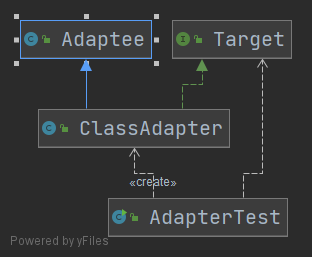
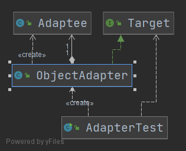
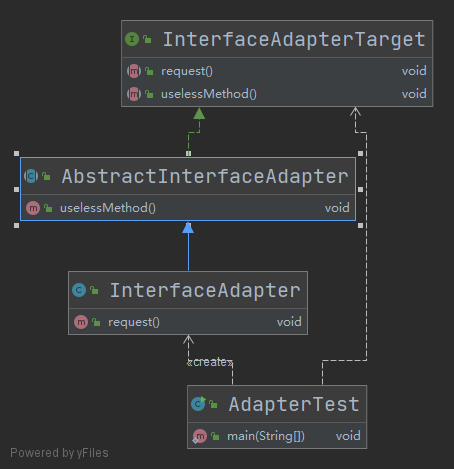

- [适配器模式](#适配器模式)
  - [1. 类适配器](#1-类适配器)
  - [2. 对象适配器](#2-对象适配器)
  - [3. 接口适配器](#3-接口适配器)

# 适配器模式

适配器模式(Adapter Pattern)通过定义一个适配器类作为两个不兼容的接口之间的桥梁，将一个类的接口转化为用户期望的另一个接口，使得两个或多个原本不兼容的接口可以基于适配器类一起工作。

适配器的实现主要分为三种：
- 类适配器：适配器与适配者之间是**继承**（或实现）关系
- 对象适配器：适配器与适配者之间是**关联**关系
- 接口适配器：适配器与适配者之间是**继承**（或实现）关系

## 1. 类适配器

在需要不改变(或者由于项目原因无法改变)原有接口或者类结构的情况下扩展类的功能以适配不同的接口，可以使用类的适配器模式。类适配器模式通过创建一个继承原有类(需要扩展的类)并实现新接口的适配器类来实现。

主要优点如下：

- 客户端通过适配器可以透明地调用目标接口。
- 复用了现存的类，程序员不需要修改原有代码而重用现有的适配者类。
- 将目标类和适配者类解耦，解决了目标类和适配者类接口不一致的问题。


其缺点是：对类适配器来说，更换适配器的实现过程比较复杂。

考虑下面的场景：我们有一个类(Adaptee),该类有一个adapteeRequest()方法。我们系统调用时，希望调用的是request()方法，这样我们的系统调用和现有的类出现不适配的情况，可以考虑使用适配器模式，新建一个Target接口，该接口有request()接口方法，然后定义适配器类ClassAdapter，该适配器类实现Target接口并继承Adaptee类，在ClassAdapter类的request()方法的实现中调用Adaptee的adapteeRequest()方法即可实现适配，详细的代码如下：



```java
/**
 * 被适配者
 *
 * @author Young
 * @Date 2021-05-31 21:26
 */
public class Adaptee {

    public void adapteeRequest() {
        System.out.println("被适配者的方法");
    }

}

/**
 * 目标接口
 *
 * @author Young
 * @Date 2021-05-31 21:26
 */
public interface Target {
    /**
     * 请求接口
     */
    void request();
}

/**
 * 类适配器
 * 怎么才可以在目标接口中的 request() 调用 Adaptee 的 adapteeRequest() 方法呢？
 * 如果直接实现 Target 是不行的
 * 如果通过一个适配器类，实现 Target 接口，同时继承了 Adaptee 类，然后在实现的 request() 方法中调用父类的 adapteeRequest() 即可实现
 */
public class ClassAdapter extends Adaptee implements Target {
    @Override
    public void request() {
        super.adapteeRequest();
    }
}

/**
 * 测试类
 *
 * @author Young
 * @Date 2021-05-31 21:28
 */
public class AdapterTest {

    public static void main(String[] args) {
        Target adapterTarget = new ClassAdapter();
        adapterTarget.request();
    }
}
//输出
concreteTarget目标方法
被适配者的方法

```

## 2. 对象适配器

对象适配器与类适配器不同之处在于，类适配器通过继承来完成适配，对象适配器则是通过关联来完成，这里稍微修改一下 `Adapter` 类即可将转变为对象适配器



```java
/**
 * 对象适配器
 *
 * @author Young
 * @Date 2021-05-31 21:30
 */
public class ObjectAdapter implements Target{

    /**
     * 适配者是对象适配器的一个属性
     */
    private static final Adaptee ADAPTEE = new Adaptee();

    @Override
    public void request() {
        ADAPTEE.adapteeRequest();
    }
}
```

## 3. 接口适配器

接口适配器的场景是：当某一个接口的方法比较多，而其实现类又不想实现所有的方法，此时可以创建一个抽象的适配器类，该抽象适配器类实现部分接口方法，实现类继承此抽象适配器类从而达到目的



```java

/**
 * 接口适配器的目标接口
 *
 * @author Young
 * @Date 2021-05-31 21:38
 */
public interface InterfaceAdapterTarget {

    /**
     * 请求接口
     */
    void request();

    /**
     * 不希望实现的类
     */
    void uselessMethod();

}

/**
 * 抽象适配器类
 *
 * @author Young
 * @Date 2021-05-31 21:39
 */
public abstract class AbstractInterfaceAdapter implements InterfaceAdapterTarget {

    @Override
    public void uselessMethod() {
        System.out.println("uselessMethod");
    }
}

/**
 * 抽象适配器的适配器类
 *
 * @author Young
 * @Date 2021-05-31 21:40
 */
public class InterfaceAdapter extends AbstractInterfaceAdapter{
    @Override
    public void request() {
        System.out.println("InterfaceAdapter");
    }
} 

/**
 * 测试类
 *
 * @author Young
 * @Date 2021-05-31 21:28
 */
public class AdapterTest {

    public static void main(String[] args) {
        InterfaceAdapterTarget interfaceAdapterTarget = new InterfaceAdapter();
        interfaceAdapterTarget.request();
    }
}

```

