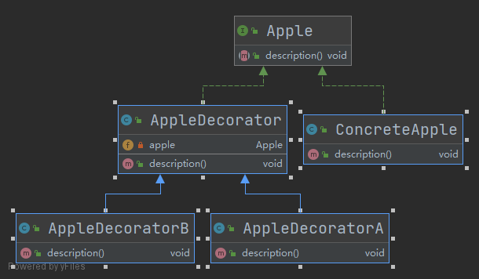

- [装饰器模式](#装饰器模式)
  - [1. 优缺点](#1-优缺点)
  - [2. Java实例](#2-java实例)
  - [3. JDK中装饰器模式](#3-jdk中装饰器模式)

# 装饰器模式

装饰器模式(Decorator Pattern)指在无须改变原有类及类的继承关系的情况下，动态扩展一个类的功能。装饰器模式通过装饰者来包裹真实的对象，并动态地向对象添加或者撤销功能。

## 1. 优缺点

**优点**

- 采用装饰模式扩展对象的功能比采用继承方式更加灵活。
- 可以设计出多个不同的具体装饰类，创造出多个不同行为的组合。

**缺点**

- 装饰模式增加了许多子类，如果过度使用会使程序变得很复杂。

## 2. Java实例



```java

/**
 * Apple
 *
 * @author Young
 * @Date 2021-06-14 11:18
 */
public interface Apple {

    /**
     * 描述
     */
    void description();

}

/**
 * 普通苹果实现
 *
 * @author Young
 * @Date 2021-06-14 11:19
 */
public class ConcreteApple implements Apple{
    @Override
    public void description() {
        System.out.println("普通的苹果");
    }
}

/**
 * Apple装饰器
 *
 * @author Young
 * @Date 2021-06-14 11:20
 */
public class AppleDecorator implements Apple{

    private Apple apple;

    public AppleDecorator(Apple apple) {
        super();
        this.apple = apple;
    }

    @Override
    public void description() {
        apple.description();
    }
}


/**
 * Apple装饰器 A
 *
 * @author Young
 * @Date 2021-06-14 11:24
 */
public class AppleDecoratorA extends AppleDecorator{

    public AppleDecoratorA(Apple apple) {
        super(apple);
    }

    @Override
    public void description() {
        System.out.println("红色苹果A");
        super.description();
    }
}

/**
 * Apple装饰器 B
 *
 * @author Young
 * @Date 2021-06-14 11:25
 */
public class AppleDecoratorB extends AppleDecorator{

    public AppleDecoratorB(Apple apple) {
        super(apple);
    }

    @Override
    public void description() {
        System.out.println("绿色苹果B");
        super.description();
    }
}

/**
 * 装饰器测试类
 *
 * @author Young
 * @Date 2021-06-14 11:33
 */
public class DecoratorTest {

    public static void main(String[] args) {
        ConcreteApple concreteApple = new ConcreteApple();
        concreteApple.description();
        System.out.println("#####");
        AppleDecoratorA appleDecoratorA = new AppleDecoratorA(concreteApple);
        appleDecoratorA.description();
        System.out.println("#####");
        AppleDecoratorB appleDecoratorB = new AppleDecoratorB(concreteApple);
        appleDecoratorB.description();
    }
}


```

## 3. JDK中装饰器模式

装饰模式在 [Java](http://c.biancheng.net/java/) 语言中的最著名的应用莫过于 Java I/O 标准库的设计了。例如，`InputStream `的子类 `FilterInputStream`，`OutputStream` 的子类 `FilterOutputStream`，`Reader` 的子类` BufferedReader` 以及 `FilterReader`，还有 Writer 的子类 `BufferedWriter`、`FilterWriter` 以及` PrintWriter `等，它们都是抽象装饰类。

下面代码是为` FileReader` 增加缓冲区而采用的装饰类 `BufferedReader` 的例子：

```java
import java.io.*;

public class JdkStreamTest {
    public static void main(String[] args) throws IOException {
        File file = new File("test1.txt");
        FileReader fileReader = new FileReader(file);
        BufferedReader bufferedReader = new BufferedReader(fileReader);
        //只能读取一个character
        System.out.println(fileReader.read());
        //只能读取一个character
        System.out.println(bufferedReader.read());
        
        //可以读取一行
        System.out.println(bufferedReader.readLine());

    }
}
```

Java 的IO类即是使用的装饰器模式，`BufferedReader`在`FileReader`上增加了新的功能`readLine()`
