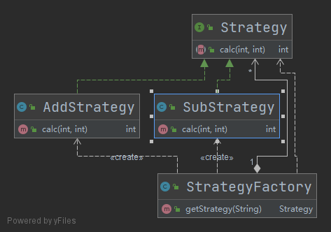

- [策略模式](#策略模式)
  - [1. 优缺点](#1-优缺点)
  - [2. Java实例](#2-java实例)

# 策略模式

该模式定义了一系列算法，并将每个算法封装起来，使它们可以相互替换，且算法的变化不会影响使用算法的客户。策略模式属于对象行为模式，它通过对算法进行封装，把使用算法的责任和算法的实现分割开来，并委派给不同的对象对这些算法进行管理。

**意图：**定义一系列的算法,把它们一个个封装起来, 并且使它们可相互替换。

**主要解决：**在有多种算法相似的情况下，使用 if...else 所带来的复杂和难以维护。

## 1. 优缺点

**优点：** 

- 算法可以自由切换
- 避免使用多重条件判断
- 扩展性良好。

**缺点：** 

- 策略类会增多
- 所有策略类都需要对外暴露。

## 2. Java实例

策略模式往往和简单工厂方法结合



```java

/**
 * 策略模式接口
 *
 * @author Young
 * @Date 2021-06-19 14:28
 */
public interface Strategy {

    /**
     * 计算两个数字
     *
     * @param num1
     * @param num2
     * @return
     */
    int calc(int num1, int num2);

}


/**
 * 加法策略
 *
 * @author Young
 * @Date 2021-06-19 14:29
 */
public class AddStrategy implements Strategy{
    @Override
    public int calc(int num1, int num2) {
        return num1 + num2;
    }
}


/**
 * 减法策略
 *
 * @author Young
 * @Date 2021-06-19 14:32
 */
public class SubStrategy implements Strategy {

    @Override
    public int calc(int num1, int num2) {
        return num1 - num2;
    }

}

/**
 * 策略工厂
 *
 * @author Young
 * @Date 2021-06-19 14:33
 */
public class StrategyFactory {

    private static Map<String, Strategy> STRATEGY_MAP;

    static {
        STRATEGY_MAP = new HashMap<>(4);
        STRATEGY_MAP.put("+", new AddStrategy());
        STRATEGY_MAP.put("-", new SubStrategy());
    }

    public Strategy getStrategy(String key) {
        return STRATEGY_MAP.get(key);
    }

}


/**
 * 策略模式测试类
 *
 * @author Young
 * @Date 2021-06-19 14:35
 */
public class StrategyTest {
    public static void main(String[] args) {
        StrategyFactory strategyFactory = new StrategyFactory();
        Strategy strategy = strategyFactory.getStrategy("+");
        System.out.println("1 + 3 = " + strategy.calc(1, 3));
    }
}


```


